---
## Front matter
lang: ru-RU
title: Отчёт по лабораторной работе №1
subtitle: Установка и проверка Rocky Linux в VirtualBox
author:
  - Амина Аджигалиева
institute:
  - Российский университет дружбы народов, Москва, Россия
date: 5 сентября 2025

## i18n babel
babel-lang: russian
babel-otherlangs: english

## Formatting pdf
toc: false
slide_level: 2
aspectratio: 169
section-titles: true
theme: metropolis
header-includes:
 - \metroset{progressbar=frametitle,sectionpage=progressbar,numbering=fraction}
---

# Цель работы

## Основная цель

Установить и настроить **Rocky Linux 10.0** в VirtualBox, проверить работу системы и базовых команд Linux.

# Ход выполнения

## Конфигурация виртуальной машины

* Имя: *aradzhigalieva*
* Память: **4 ГБ**, CPU: **4 ядра**
* Диск: **40 ГБ**, Видео: **128 МБ**

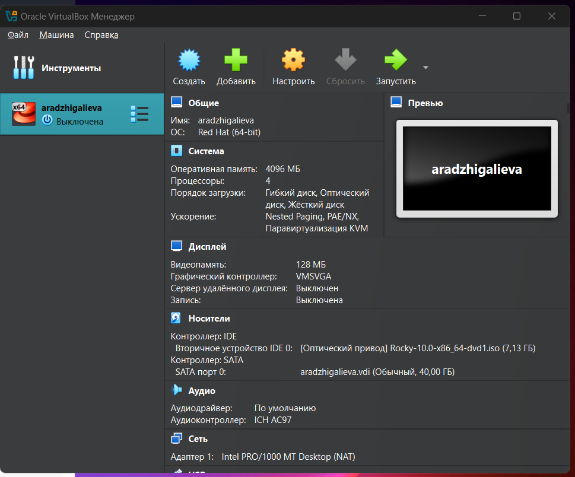{ #fig:001 width=70% }

## Запуск установщика (GRUB)

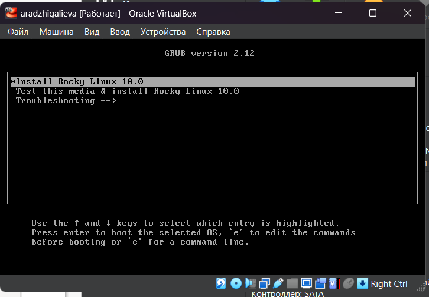{ #fig:002 width=70% }

## Выбор языка

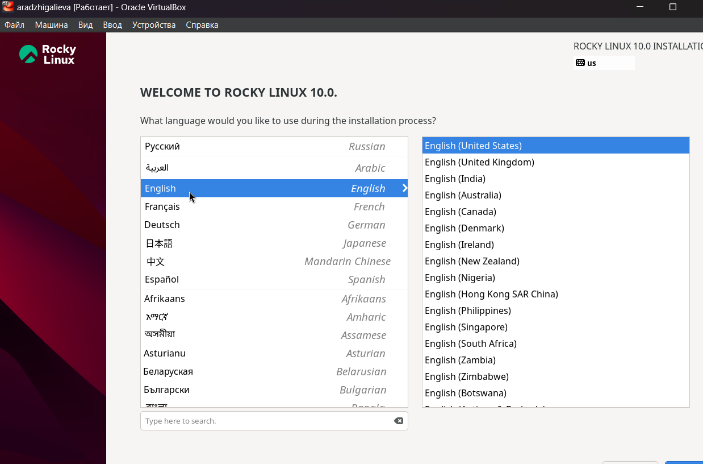{ #fig:003 width=70% }

## Выбор окружения

* **Server with GUI**
* Дополнительно: **Development Tools**

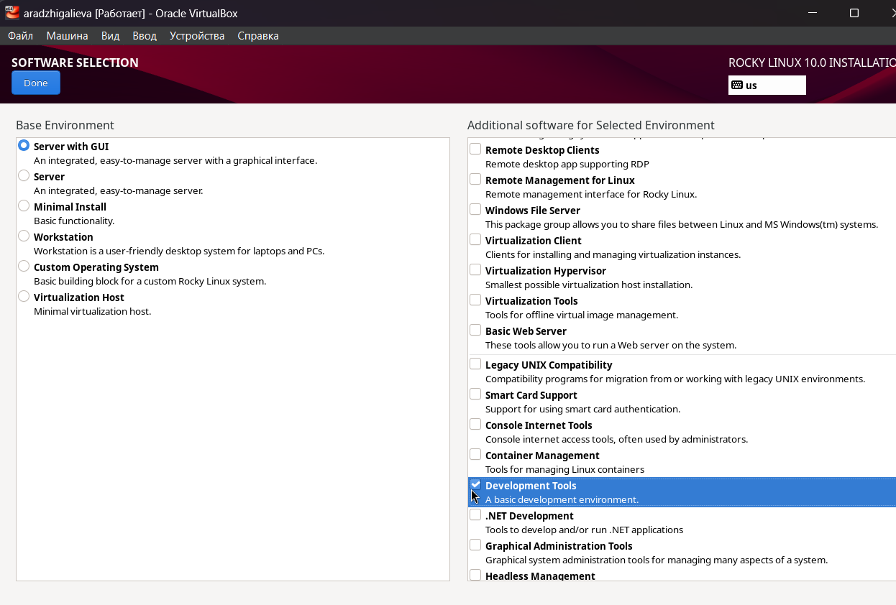{ #fig:004 width=70% }

## Настройка диска

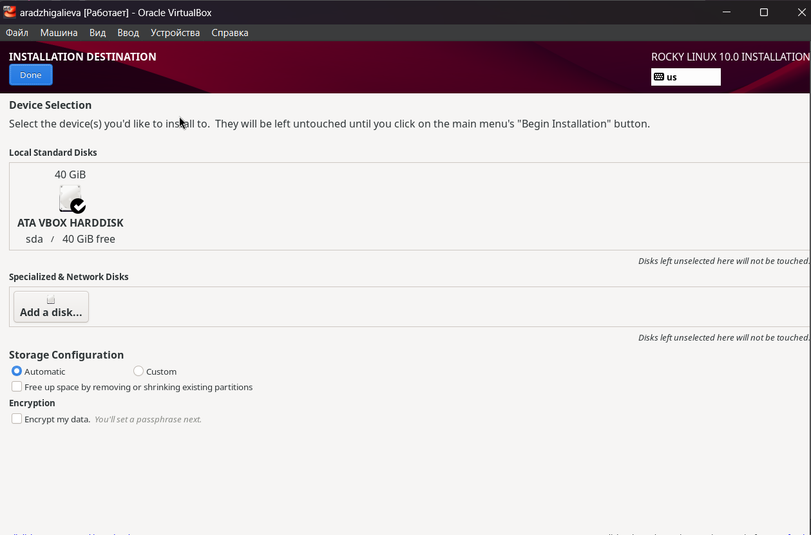{ #fig:005 width=70% }

## KDUMP

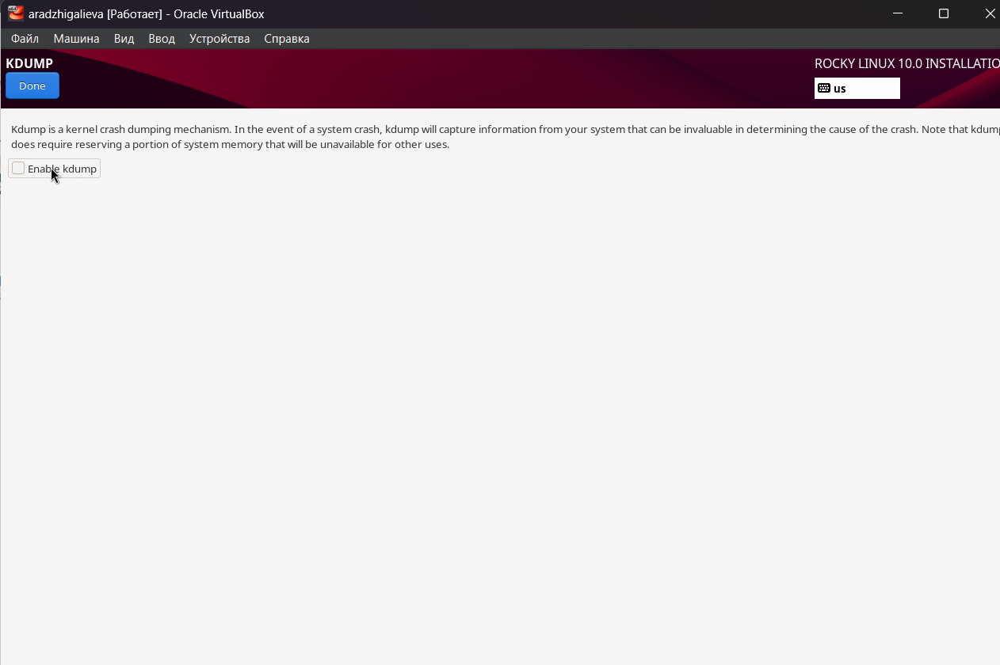{ #fig:006 width=70% }

## Настройка сети

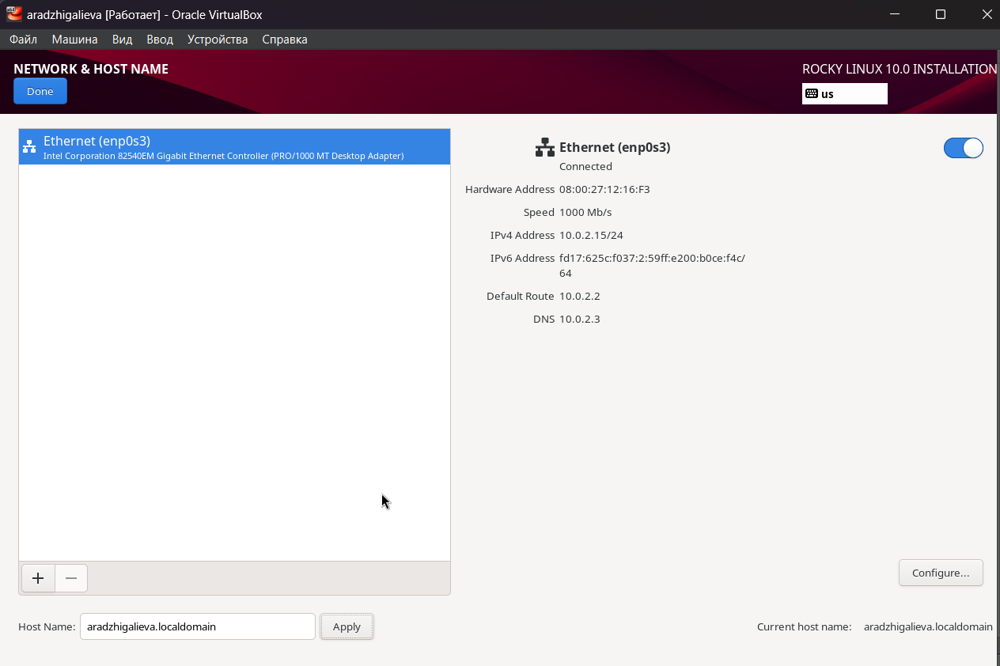{ #fig:007 width=70% }

## Root-учётная запись

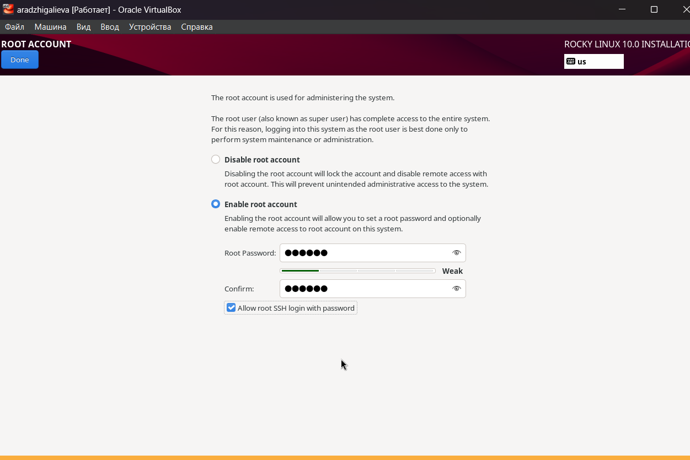{ #fig:008 width=70% }

## Создание пользователя

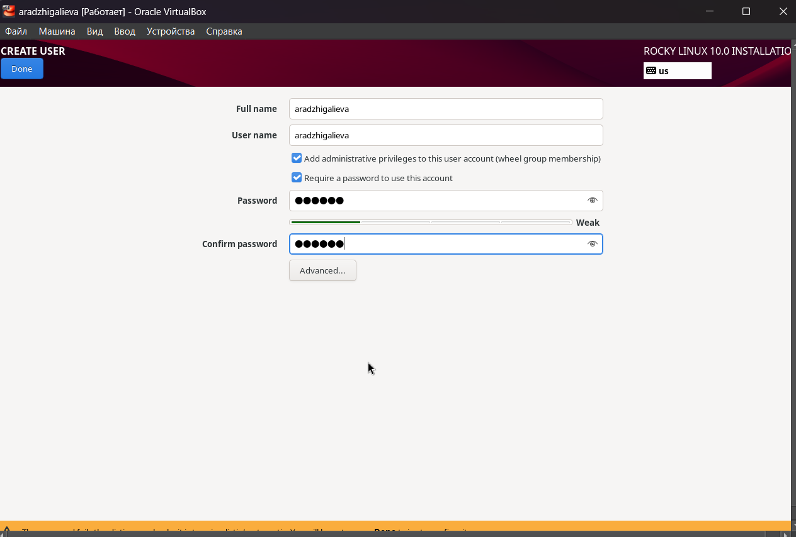{ #fig:009 width=70% }

## Завершение установки

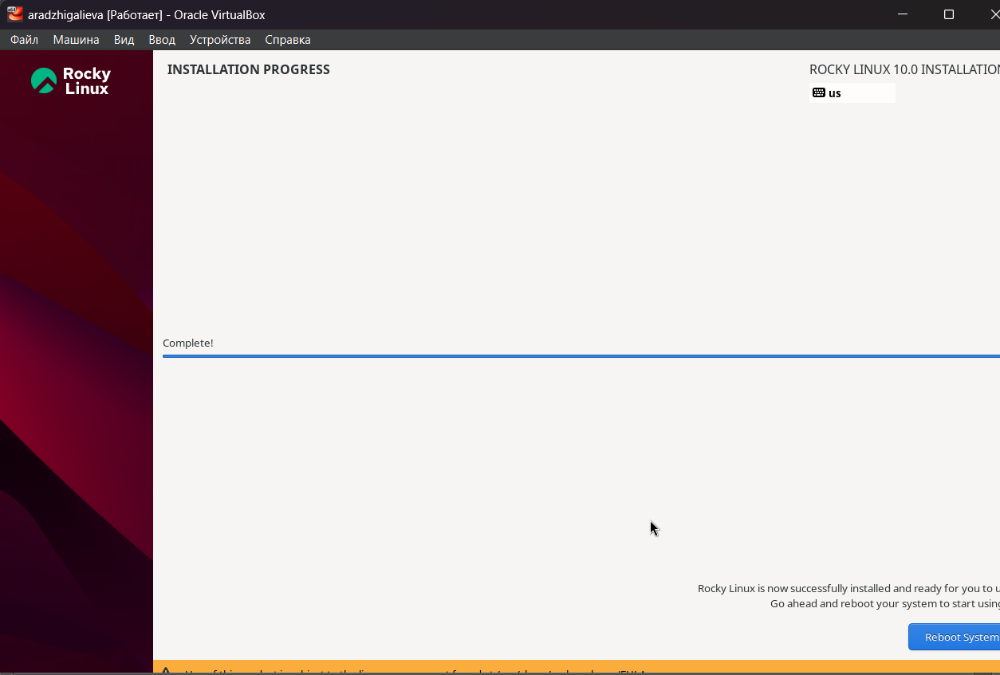{ #fig:010 width=70% }

## Установка Guest Additions

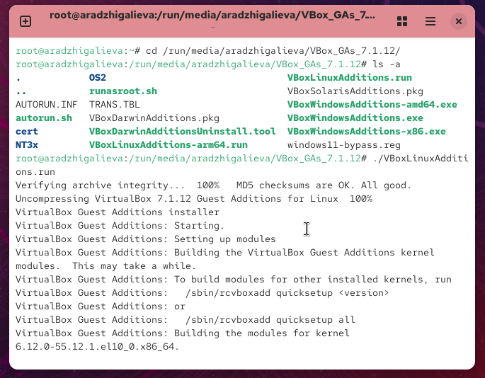{ #fig:011 width=70% }

# Проверка системы

## Информация о ядре

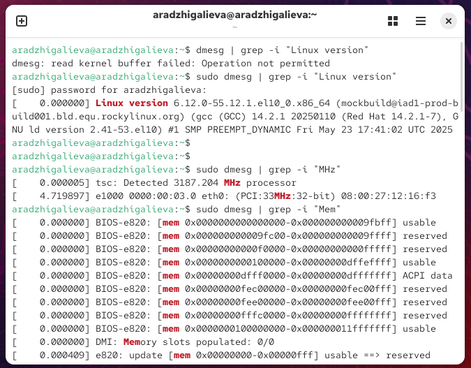{ #fig:012 width=70% }

## Гипервизор

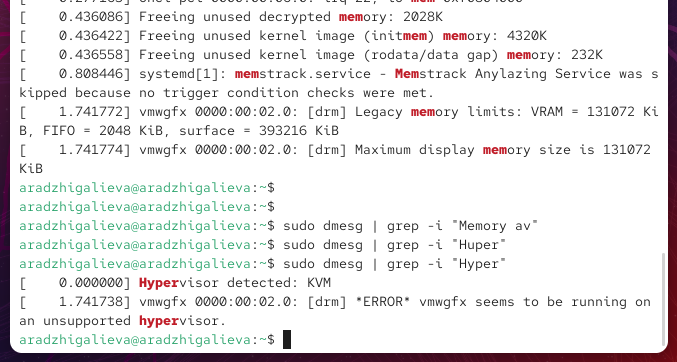{ #fig:013 width=70% }

## Смонтированные файловые системы

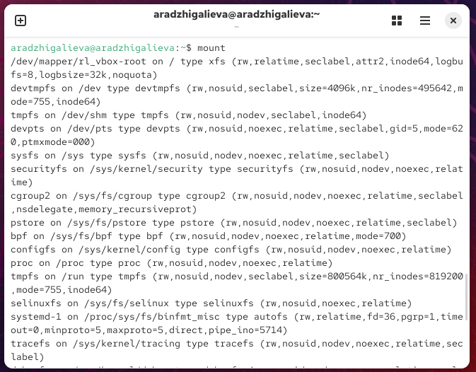{ #fig:014 width=70% }

# Итоги

## Вывод

* Установка Rocky Linux прошла успешно.
* Настроены сеть, пользователи и локализация.
* Установлены Guest Additions для интеграции с VirtualBox.
* Проверены: ядро, процессор, память, гипервизор и файловые системы.
