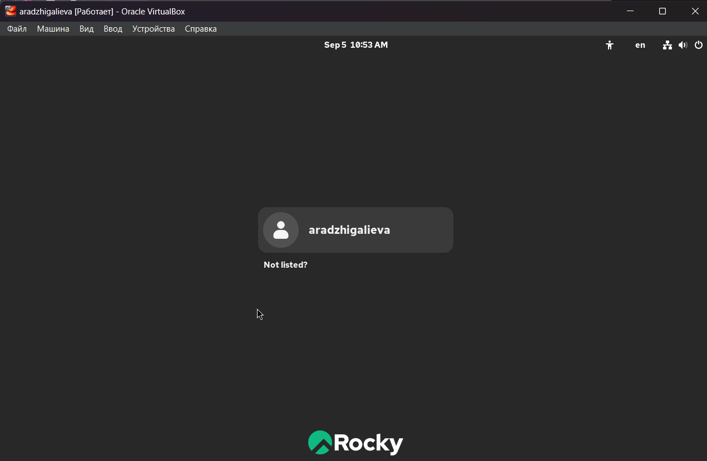

---
## Front matter
title: "Отчёт по лабораторной работе №1"
subtitle: "Установка и проверка работы Rocky Linux в VirtualBox"
author: "Амина Аджигалиева"

## Generic otions
lang: ru-RU
toc-title: "Содержание"

## Bibliography
bibliography: bib/cite.bib
csl: pandoc/csl/gost-r-7-0-5-2008-numeric.csl

## Pdf output format
toc: true
toc-depth: 2
lof: true
lot: true
fontsize: 12pt
linestretch: 1.5
papersize: a4
documentclass: scrreprt
## I18n polyglossia
polyglossia-lang:
  name: russian
  options:
    - spelling=modern
    - babelshorthands=true
polyglossia-otherlangs:
  name: english
## I18n babel
babel-lang: russian
babel-otherlangs: english
## Fonts
mainfont: IBM Plex Serif
romanfont: IBM Plex Serif
sansfont: IBM Plex Sans
monofont: IBM Plex Mono
mathfont: STIX Two Math
mainfontoptions: Ligatures=Common,Ligatures=TeX,Scale=0.94
romanfontoptions: Ligatures=Common,Ligatures=TeX,Scale=0.94
sansfontoptions: Ligatures=Common,Ligatures=TeX,Scale=MatchLowercase,Scale=0.94
monofontoptions: Scale=MatchLowercase,Scale=0.94,FakeStretch=0.9
mathfontoptions:
## Biblatex
biblatex: true
biblio-style: "gost-numeric"
biblatexoptions:
  - parentracker=true
  - backend=biber
  - hyperref=auto
  - language=auto
  - autolang=other*
  - citestyle=gost-numeric
## Pandoc-crossref LaTeX customization
figureTitle: "Рис."
tableTitle: "Таблица"
listingTitle: "Листинг"
lofTitle: "Список иллюстраций"
lotTitle: "Список таблиц"
lolTitle: "Листинги"
## Misc options
indent: true
header-includes:
  - \usepackage{indentfirst}
  - \usepackage{float}
  - \floatplacement{figure}{H}
---

# Цель работы

Цель данной лабораторной работы — освоить процесс установки и базовой настройки операционной системы **Rocky Linux** в виртуальной среде **VirtualBox**. В процессе выполнения были изучены основные этапы: подготовка виртуальной машины, установка ОС, настройка пользователей и сети, а также проверка работы базовых команд Linux.

# Ход выполнения

## Создание виртуальной машины

Создана виртуальная машина *aradzhigalieva* с параметрами: 4 ГБ оперативной памяти, 4 виртуальных процессора, диск объёмом 40 ГБ, 128 МБ видеопамяти (рис. \[@fig:001]).

{ #fig:001 width=70% }

## Загрузка установщика

При запуске с ISO-образа **Rocky Linux 10.0** система загрузилась в меню **GRUB**, где выбран пункт *Install Rocky Linux 10.0* (рис. \[@fig:002]).

{ #fig:002 width=70% }

## Выбор языка

Для установки выбран язык **English (United States)** (рис. \[@fig:003]).

{ #fig:003 width=70% }

## Выбор окружения

Выбрана установка **Server with GUI** с добавлением пакета **Development Tools** (рис. \[@fig:004]).

{ #fig:004 width=70% }

## Настройка диска

ОС установлена на виртуальный диск 40 ГБ с автоматическим разбиением (рис. \[@fig:005]).

{ #fig:005 width=70% }

## KDUMP

Функция **Kdump** оставлена отключённой (рис. \[@fig:006]).

{ #fig:006 width=70% }

## Настройка сети

Сетевой адаптер настроен через NAT. ВМ получила IPv4-адрес в подсети 10.0.2.0/24 (рис. \[@fig:007]).

{ #fig:007 width=70% }

## Root-пользователь

Задан пароль для root. Включён доступ по SSH (рис. \[@fig:008]).

{ #fig:008 width=70% }

## Создание пользователя

Создан пользователь *aradzhigalieva* с административными правами (рис. \[@fig:009]).

{ #fig:009 width=70% }

## Настройка языка

Добавлена русская раскладка клавиатуры (рис. \[@fig:010])

{ #fig:010 width=70% }

## Начало установки

Все параметры установлены (рис. \[@fig:011])

{ #fig:011 width=70% }

## Завершение установки

Установка завершена успешно, система готова к использованию (рис. \[@fig:012]).

{ #fig:012 width=70% }

{ #fig:013 width=70% }

## Установка Guest Additions

Для интеграции с VirtualBox установлены **Guest Additions** (рис. \[@fig:014]).

{ #fig:014 width=70% }

## Проверка системы с помощью dmesg

Команды `dmesg` использованы для проверки версии ядра, процессора, памяти и гипервизора (рис. \[@fig:015], \[@fig:016]).

Команда `mount` показала использование файловой системы XFS для основного раздела (рис. \[@fig:017]).

{ #fig:015 width=70% }

{ #fig:016 width=70% }

{ #fig:017 width=70% }

# Контрольные вопросы

1. **Укажите команды терминала и приведите примеры:**

   * Получение справки: `man ls`, `ls --help`.
   * Перемещение: `cd /home`, `cd ..`.
   * Просмотр содержимого: `ls -l`, `ls -a`.
   * Определение объёма: `du -sh /var/log`.
   * Создание / удаление: `mkdir dir`, `rmdir dir`, `touch file.txt`, `rm file.txt`.
   * Управление правами: `chmod 644 file.txt`, `chown user:user file.txt`.
   * История команд: `history`.

2. **Какую информацию содержит учётная запись пользователя? Какие команды позволяют посмотреть её?**
   Учётная запись хранит имя пользователя, UID, GID, домашний каталог, оболочку. Просмотр: `id`, `whoami`, `cat /etc/passwd`.

3. **Что такое файловая система? Примеры:**

   * **EXT4** — стабильная, универсальная.
   * **XFS** — высокая производительность с большими файлами.
   * **Btrfs** — поддержка снапшотов и самопроверки.

4. **Как посмотреть смонтированные файловые системы?**
   Команды: `mount`, `df -h`, `cat /etc/mtab`.

5. **Как удалить зависший процесс?**
   Найти PID: `ps aux | grep имя_процесса`, `top`.
   Завершить: `kill -9 PID`.

# Заключение

В ходе лабораторной работы я установила и настроила **Rocky Linux 10.0** в VirtualBox. Были выполнены основные шаги: настройка ВМ, установка ОС, создание пользователей, включение сети, установка Guest Additions и проверка команд Linux. Система работает корректно, цель работы выполнена.

