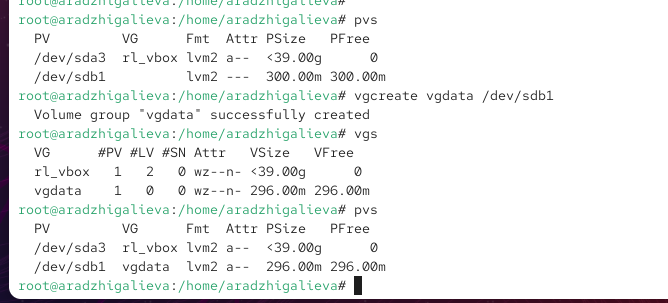
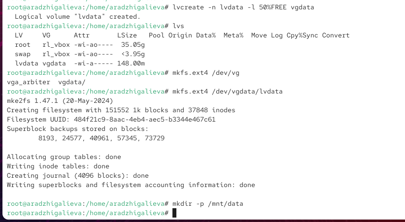
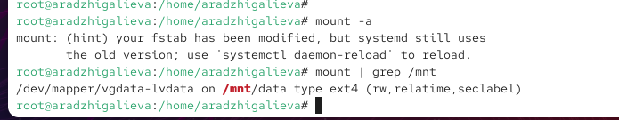
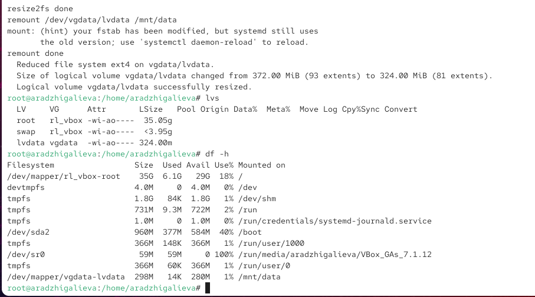
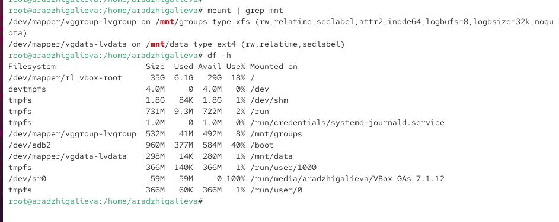
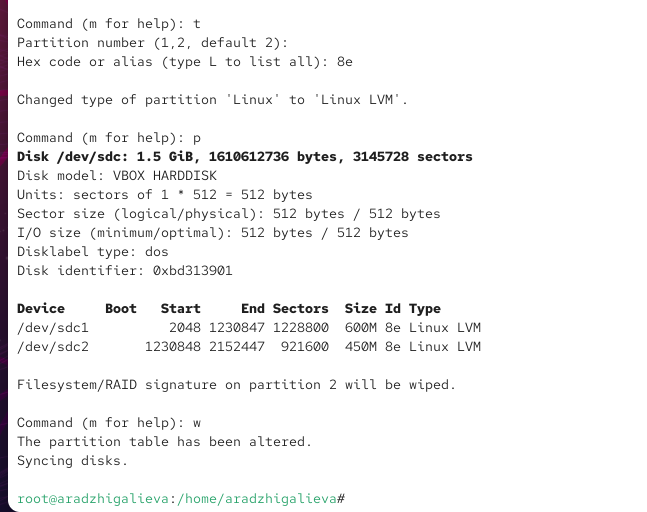
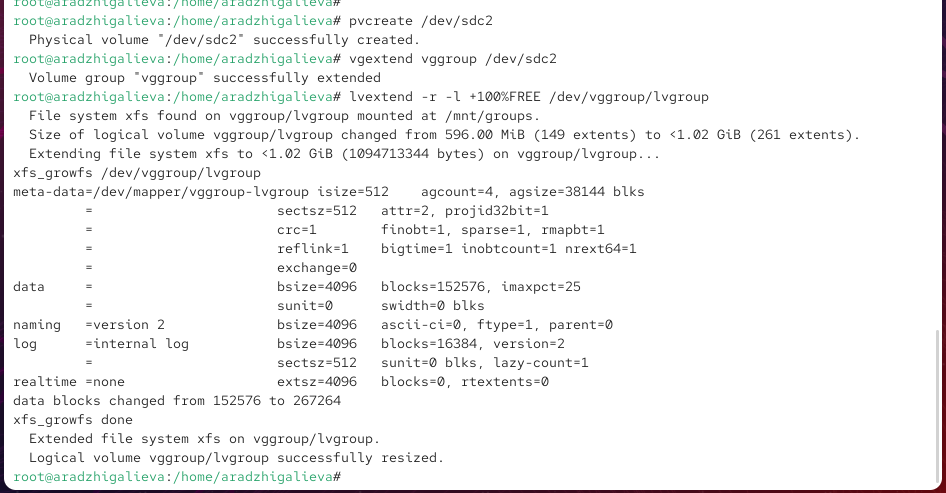

---
## Front matter
title: "Отчёт по лабораторной работе №15"
subtitle: "Управление логическими томами"
author: "Амина Аджигалиева"

## Generic otions
lang: ru-RU
toc-title: "Содержание"

## Bibliography
bibliography: bib/cite.bib
csl: pandoc/csl/gost-r-7-0-5-2008-numeric.csl

## Pdf output format
toc: true
toc-depth: 2
lof: true
lot: true
fontsize: 12pt
linestretch: 1.5
papersize: a4
documentclass: scrreprt
## I18n polyglossia
polyglossia-lang:
  name: russian
  options:
    - spelling=modern
    - babelshorthands=true
polyglossia-otherlangs:
  name: english
## I18n babel
babel-lang: russian
babel-otherlangs: english
## Fonts
mainfont: IBM Plex Serif
romanfont: IBM Plex Serif
sansfont: IBM Plex Sans
monofont: IBM Plex Mono
mathfont: STIX Two Math
mainfontoptions: Ligatures=Common,Ligatures=TeX,Scale=0.94
romanfontoptions: Ligatures=Common,Ligatures=TeX,Scale=0.94
sansfontoptions: Ligatures=Common,Ligatures=TeX,Scale=MatchLowercase,Scale=0.94
monofontoptions: Scale=MatchLowercase,Scale=0.94,FakeStretch=0.9
mathfontoptions:
## Biblatex
biblatex: true
biblio-style: "gost-numeric"
biblatexoptions:
  - parentracker=true
  - backend=biber
  - hyperref=auto
  - language=auto
  - autolang=other*
  - citestyle=gost-numeric
## Pandoc-crossref LaTeX customization
figureTitle: "Рис."
tableTitle: "Таблица"
listingTitle: "Листинг"
lofTitle: "Список иллюстраций"
lotTitle: "Список таблиц"
lolTitle: "Листинги"
## Misc options
indent: true
header-includes:
  - \usepackage{indentfirst}
  - \usepackage{float}
  - \floatplacement{figure}{H}
---

# Цель работы

Получить навыки управления логическими томами.

# Ход выполнения работы

## Создание физического тома

Сначала была выполнена разметка диска **/dev/sdb** с помощью утилиты `fdisk`.  
Был создан новый раздел объёмом **300 МБ**, которому назначен тип **8e (Linux LVM)**.  
Перед записью изменений утилита предложила удалить найденную XFS-сигнатуру.

{ #fig:001 width=80% }

После завершения разметки таблица разделов была перечитана с помощью команды `partprobe`.  
Затем был создан физический том `/dev/sdb1`, что подтверждается выводом `pvs`.

{ #fig:002 width=80% }

## Создание группы томов и логического тома

На основе созданного физического тома была сформирована группа томов **vgdata**.  
Проверка `vgs` показала корректное создание группы.  

После этого был создан логический том **lvdata**, использующий **50% доступного места** группы томов.  
Факт создания подтверждён выводом `lvs`.

{ #fig:003 width=80% }

Далее на логическом томе была создана файловая система **EXT4**.  
Создан каталог монтирования `/mnt/data`, после чего соответствующая запись добавлена в файл `/etc/fstab`.

{ #fig:004 width=80% }

Проверка автоматического монтирования показала корректное подключение системы на `/mnt/data`.

{ #fig:005 width=80% }

## Расширение группы томов и увеличение размера LV

Был создан второй раздел **/dev/sdb2** объёмом **300 МБ** с типом **8e**, предназначенный для расширения группы томов.

{ #fig:006 width=80% }

После этого создан дополнительный физический том, а группа томов **vgdata** была расширена.  
Проверка `vgs`, `lvs` и `df -h` показала появление нового свободного пространства.

{ #fig:007 width=80% }

### Увеличение логического тома

Размер логического тома **lvdata** был увеличен на **50% свободного места** в группе томов.  
Процесс сопровождался автоматическим онлайн-расширением файловой системы.

{ #fig:008 width=80% }

## Уменьшение логического тома

На завершающем этапе логический том был уменьшен на **50 МБ**.  
Том временно размонтировался, после уменьшения был подключён обратно.  
Вывод команд подтверждает корректность операции.

{ #fig:009 width=80% }

## Самостоятельная работа

Для начала был создан новый раздел на диске **/dev/sdc**, которому назначен тип **8e (Linux LVM)** и размер **600 МБ**. После изменения разметки таблица разделов была перечитана.

{ #fig:010 width=80% }

Далее был создан каталог для монтирования:

`/mnt/groups`

Затем был создан физический том на базе раздела `/dev/sdc1`, после чего сформирована группа томов **vggroup**, а внутри неё создан логический том **lvgroup**, использующий всё доступное место группы томов.

{ #fig:011 width=80% }

Логический том был отформатирован в файловой системе **XFS** и подготовлен к использованию:

{ #fig:012 width=80% }

В файл `/etc/fstab` была добавлена строка для постоянного монтирования:

{ #fig:013 width=80% }

После перезагрузки виртуальной машины было выполнено подтверждение успешного монтирования тома:

{ #fig:014 width=80% }

Для увеличения тома был создан новый раздел **/dev/sdc2** с типом **8e** и размером **450 МБ**, который затем преобразован в физический том.

{ #fig:015 width=80% }

После этого группа томов **vggroup** была расширена за счёт нового физического тома `/dev/sdc2`.

Был выполнен прирост логического тома **lvgroup** на всё доступное свободное пространство группы:

{ #fig:016 width=80% }

Файловая система XFS была увеличена автоматически с помощью `xfs_growfs`, что подтверждается выводом команды.

Для проверки были выполнены команды `pvs`, `lvs`, `vgs` и `df -h`, которые показали обновлённый объём логического тома и файловой системы.

{ #fig:017 width=80% }

# Контрольные вопросы

1. **Какой тип раздела используется в разделе GUID для работы с LVM?**  
   Для LVM в GPT используется тип раздела **0x8e00 (Linux LVM)**.

2. **Какой командой можно создать группу томов с именем vggroup, которая содержит физическое устройство /dev/sdb3 и использует физический экстент 4 MiB?**  
   `vgcreate -s 4M vggroup /dev/sdb3`

3. **Какая команда показывает краткую сводку физических томов в вашей системе, а также группу томов, к которой они принадлежат?**  
   `pvs`

4. **Что вам нужно сделать, чтобы добавить весь жёсткий диск /dev/sdd в группу томов?**  
   Сначала создать физический том:  
   `pvcreate /dev/sdd`  
   Затем расширить группу томов:  
   `vgextend <имя_группы> /dev/sdd`

5. **Какая команда позволяет вам создать логический том lvvol1 с размером 6 MiB?**  
   `lvcreate -n lvvol1 -L 6M <имя_группы>`

6. **Какая команда позволяет вам добавить 100 МБ в логический том lvvol1, если пространство доступно?**  
   `lvextend -L +100M /dev/<VG>/lvvol1`

7. **Каков первый шаг, чтобы добавить ещё 200 МБ дискового пространства в логический том, если требуемое пространство недоступно в группе томов?**  
   Добавить новый физический том:  
   `pvcreate <новый_диск_или_раздел>`  
   Затем расширить группу томов.

8. **Какую опцию нужно использовать с командой lvextend, чтобы также изменить размер файловой системы?**  
   Используется опция **`-r`** (resize).

9. **Как посмотреть, какие логические тома доступны?**  
   `lvs`

10. **Какую команду нужно использовать для проверки целостности файловой системы на /dev/vgdata/lvdata?**  
   Для ext4:  
   `e2fsck -f /dev/vgdata/lvdata`  
   Для XFS:  
   `xfs_repair /dev/vgdata/lvdata`

# Заключение

В ходе выполнения самостоятельной работы я последовательно применила механизмы управления логическими томами в Linux.  
Я создала физические тома, объединила их в группы, сформировала логические тома, отформатировала их в разные файловые системы и настроила постоянное монтирование.  
Также была выполнена переразметка дисков, расширение и уменьшение логических томов, а вместе с ними — онлайн-изменение размеров файловых систем.  