---
## Front matter
title: "Отчёт по прохождению внешнего курса: Системный администратор Linux с нуля"
subtitle: "Часть 1"
author: "Амина Аджигалиева"

## Generic otions
lang: ru-RU
toc-title: "Содержание"

## Bibliography
bibliography: bib/cite.bib
csl: pandoc/csl/gost-r-7-0-5-2008-numeric.csl

## Pdf output format
toc: true # Table of contents
toc-depth: 2
lof: true # List of figures
fontsize: 12pt
linestretch: 1.5
papersize: a4
documentclass: scrreprt
## I18n polyglossia
polyglossia-lang:
  name: russian
  options:
	- spelling=modern
	- babelshorthands=true
polyglossia-otherlangs:
  name: english
## I18n babel
babel-lang: russian
babel-otherlangs: english
## Fonts
mainfont: IBM Plex Serif
romanfont: IBM Plex Serif
sansfont: IBM Plex Sans
monofont: IBM Plex Mono
mathfont: STIX Two Math
mainfontoptions: Ligatures=Common,Ligatures=TeX,Scale=0.94
romanfontoptions: Ligatures=Common,Ligatures=TeX,Scale=0.94
sansfontoptions: Ligatures=Common,Ligatures=TeX,Scale=MatchLowercase,Scale=0.94
monofontoptions: Scale=MatchLowercase,Scale=0.94,FakeStretch=0.9
mathfontoptions:
## Biblatex
biblatex: true
biblio-style: "gost-numeric"
biblatexoptions:
  - parentracker=true
  - backend=biber
  - hyperref=auto
  - language=auto
  - autolang=other*
  - citestyle=gost-numeric
## Pandoc-crossref LaTeX customization
figureTitle: "Рис."
tableTitle: "Таблица"
listingTitle: "Листинг"
lofTitle: "Список иллюстраций"
lolTitle: "Листинги"
## Misc options
indent: true
header-includes:
  - \usepackage{indentfirst}
  - \usepackage{float} # keep figures where there are in the text
  - \floatplacement{figure}{H} # keep figures where there are in the text
---

# Цель работы
Изучить основы системного администрирования и Linux

# Ход выполнения

## Тест Роль системного админинстратора Linux

Что относится к философии свободного ПО?
К философии свободного ПО относится возможность модификации программы под свои задачи без нарушения авторских прав. 

{ #fig:001 width=70% }

Какой инструмент можно использовать для мониторинга сервисов?
Zabbix - универсальная система мониторинга с открытым исходным кодом

{ #fig:002 width=70% }

Какая из задач относится к ключевым обязанностям системного администратора?
Мониторинг состояния серверов одна из ключевых обязанностей

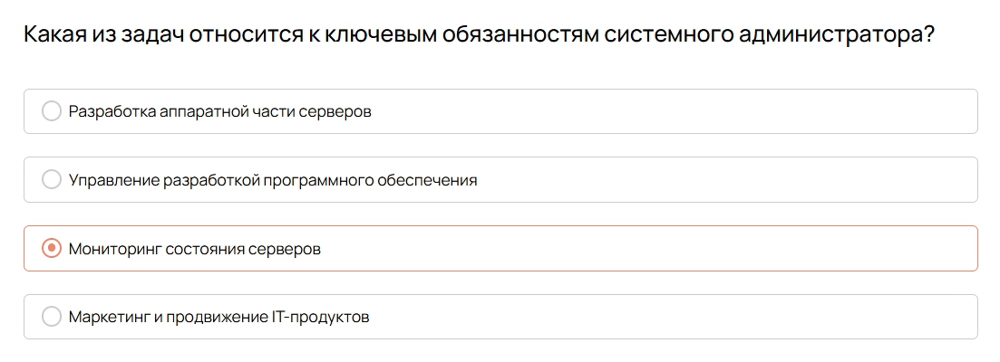{ #fig:003 width=70% }

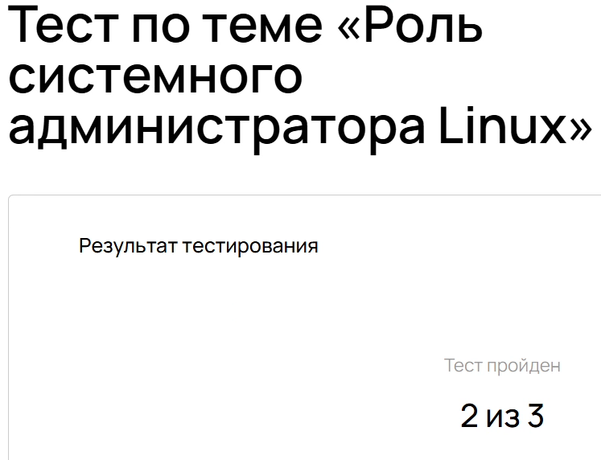{ #fig:004 width=70% }

## Вводный урок
Как называется самая популярная оболочка?
Bash - командная оболочка для Unix-подобных систем

{ #fig:005 width=70% }

Какая команда выводит наиболее полную справочную информацию?
man - команда для доступа к справочной информации

{ #fig:006 width=70% }

Для чего пользователю иногда требуются повышенные привилегии?
Для выполнения административной задачи

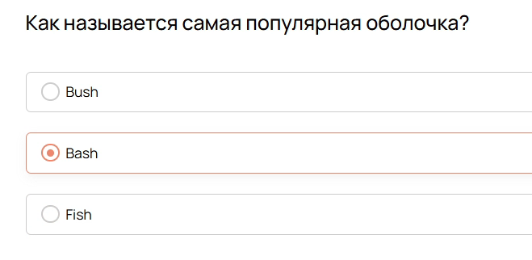{ #fig:007 width=70% }

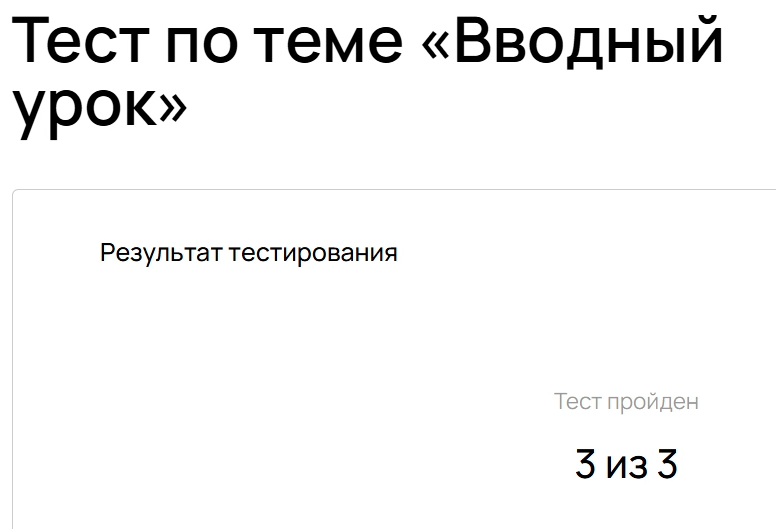{ #fig:008 width=70% }

## Роль командной строки в серверной строке

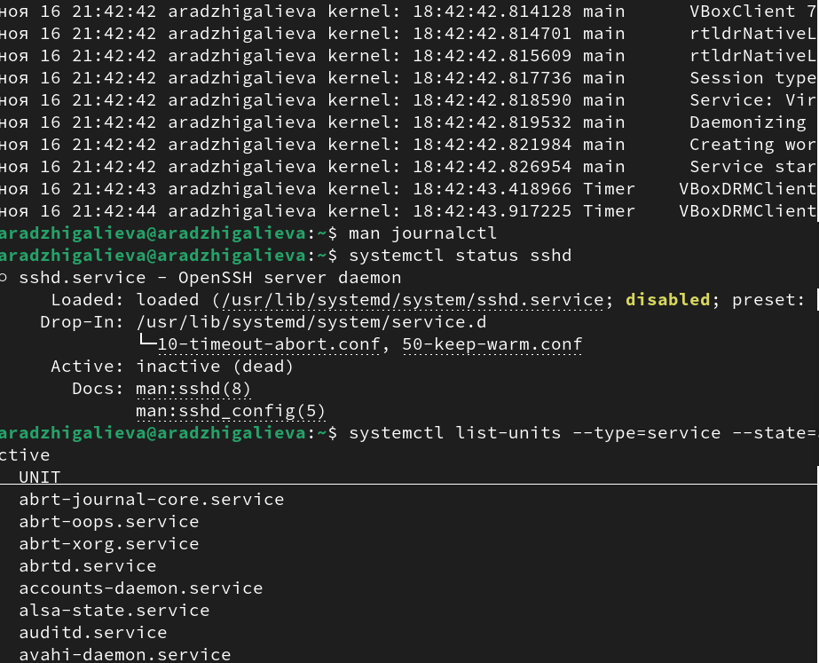{ #fig:009 width=70% }

Какое главное преимущество отсутствия графического интерфейса на сервере?
Экономия ресурсов и повышение стабильности

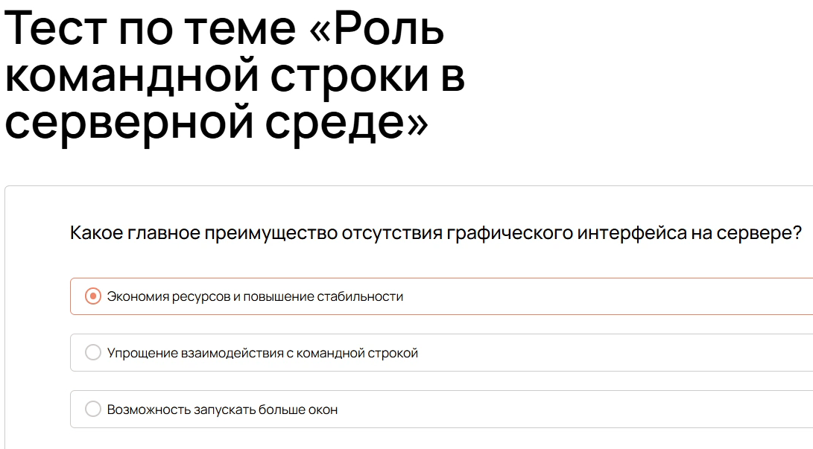{ #fig:010 width=70% }

Почему SSH так популярен в администрировании?
Дает безопасный канал для удаленной работы

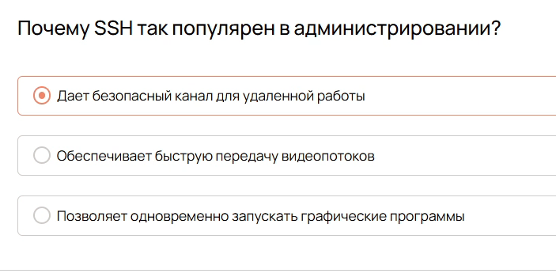{ #fig:011 width=70% }

Что отличает терминал от оболочки?
Терминал — это место ввода/вывода команд, оболочка — программа, которая их интерпретирует

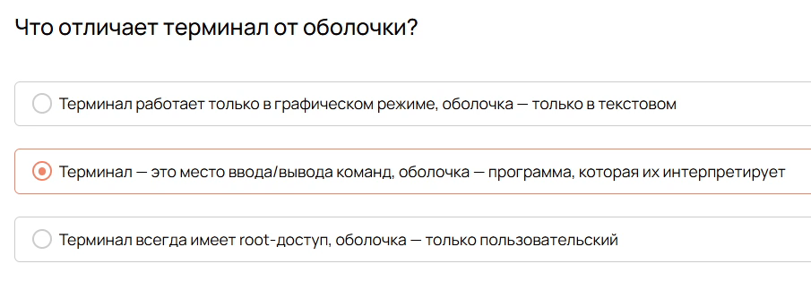{ #fig:012 width=70% }

{ #fig:013 width=70% }

## Файловая структура и каталоги 

{ #fig:014 width=70% }

{ #fig:015 width=70% }

В какой каталог обычно помещаются конфигурационные файлы служб в Linux?
/etc

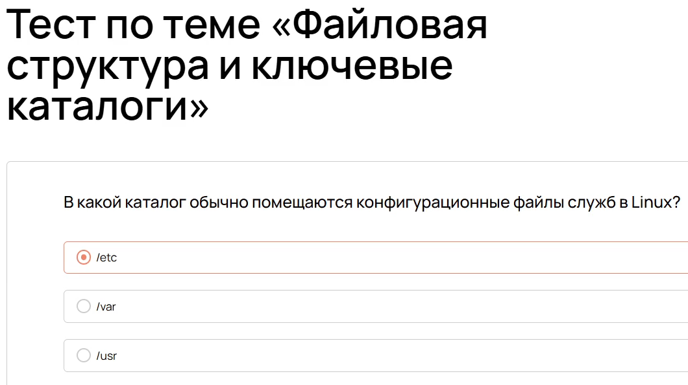{ #fig:016 width=70% }

Где чаще всего хранятся логи системных сервисов и приложений?
/var/log

{ #fig:017 width=70% }

Какую роль выполняет /opt в структуре файловой системы?
Дополнительное ПО, которое не входит в стандартные репозитории

{ #fig:018 width=70% }

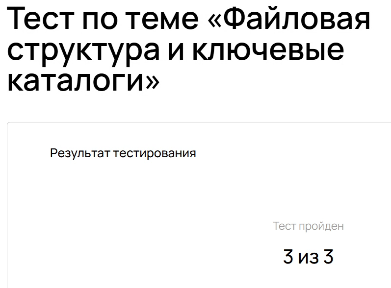{ #fig:019 width=70% }
 
## Принцип "Все есть файл"

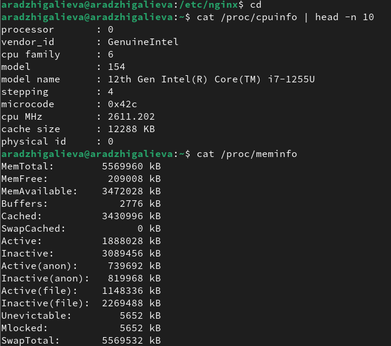{ #fig:020 width=70% }

Для чего служит каталог /dev?
Для хранения драйверов системы

{ #fig:021 width=70% }
 
Что отображает виртуальная файловая система /proc?
Состояние оперативной памяти и процессов "на лету"

{ #fig:022 width=70% }
 
Какая команда позволяет просматривать данные из каталогов /proc или /dev, исользуя принципы работы с файлами? 
cat

{ #fig:023 width=70% }

{ #fig:024 width=70% }
 
## Работа с базовыми командами в реальных условиях

{ #fig:025 width=70% }

Какая команда выводит путь к текущей директории?
pwd

{ #fig:026 width=70% }

Как показать скрытые файлы и каталоги?
ls -a

{ #fig:027 width=70% }

Как перейти в каталог /etc/apache2, если вы уже в /etc?
cd apache2

{ #fig:028 width=70% }

Что означает ~ при вводе команды cd ~?
Домашнюю директорию текущего пользователя

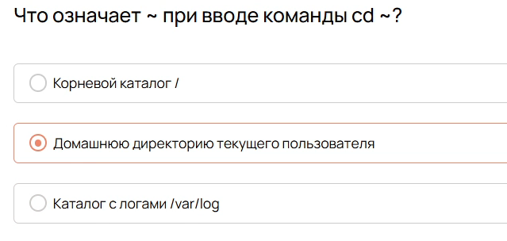{ #fig:029 width=70% }

Для чего используется команда ls -l | grep ssh?
Для фильтрации строк с упоминанием ssh из списка файлов

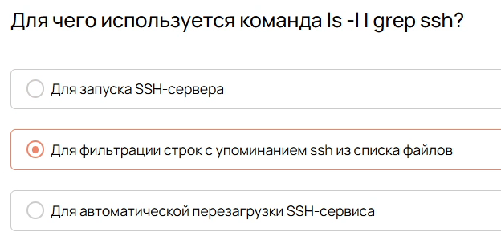{ #fig:030 width=70% }

{ #fig:031 width=70% }

## Работа с архивами и передача данных между серверами

{ #fig:032 width=70% }

Какая команда создает сжатый архив из папки? 
tar -czf

{ #fig:033 width=70% }

Как извлечь архив?
Верный ответ: tar -xzf

{ #fig:034 width=70% }

Как скопировать папку с файлами на сервер?
Верный ответ: scp -r folder user@server:/backup

{ #fig:035 width=70% }

{ #fig:036 width=70% }

## Основы автоматизации с помощью Bash-скриптов

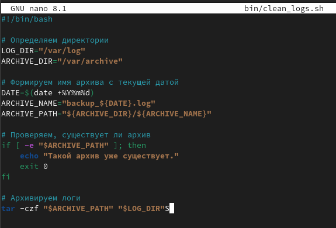{ #fig:037 width=70% }

Как сделать файл исполняемым?
Верный ответ: chmod +x

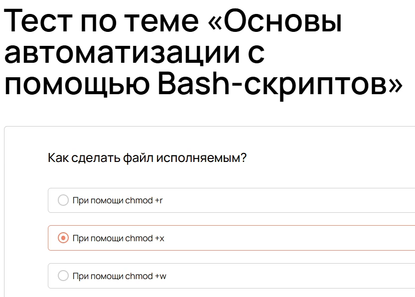{ #fig:038 width=70% }

Как добавить комментарий в скрипт?
Верный ответ: #

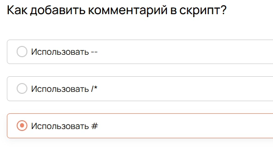{ #fig:039 width=70% }

Что делает команда find /var/log -type f -mtime +7 -exec rm -f {}?
Верный ответ: Находит и удаляет файлы старше 7 дней.

{ #fig:040 width=70% }

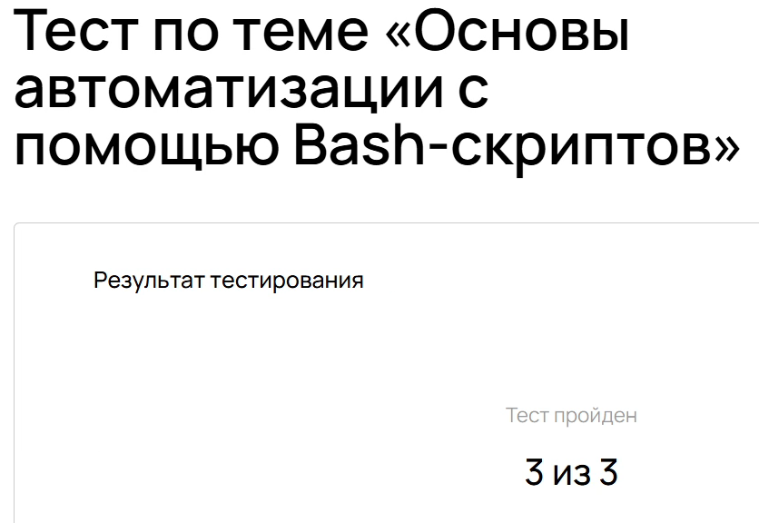{ #fig:041 width=70% }

# Заключение

Освоили основы администрирования

