---
## Front matter
lang: ru-RU
title: Внешний курс. Часть 2
author:
  - Аджигалиева Амина Руслановна
institute:
  - Российский университет дружбы народов, Москва, Россия
date: 20 ноября 2025

## i18n babel
babel-lang: russian
babel-otherlangs: english

## Formatting pdf
toc: false
toc-title: Содержание
slide_level: 2
aspectratio: 169
section-titles: true
theme: metropolis
header-includes:
 - \metroset{progressbar=frametitle,sectionpage=progressbar,numbering=fraction}
---
# Цель работы

Изучить основы системного администрирования и Linux

Освоить ключевые аспекты работы с операционной системой

# Поиск справочной информации

## Команда man

**man grep** - отображает справочную страницу

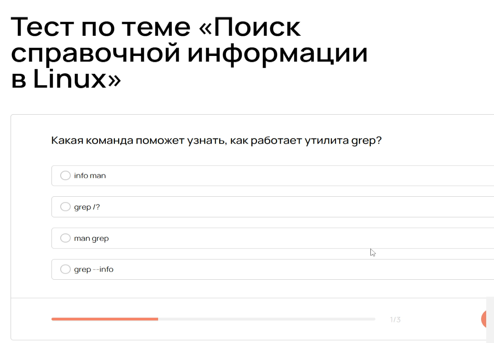{#fig:001 width=70%}

## Команда info

**info** - альтернативный формат справки

{#fig:002 width=70%}

## Документация программ

**/usr/share/doc** - текстовые справочные файлы

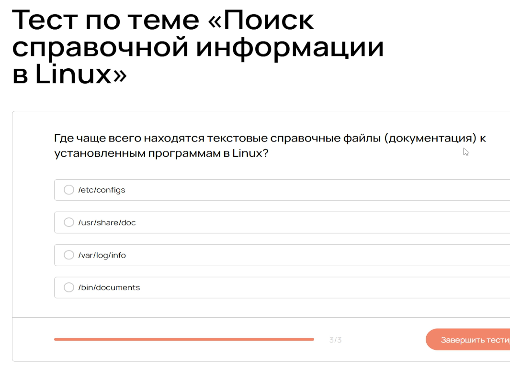{#fig:003 width=70%}

# Работа с текстовыми файлами

## Создание файлов

**cat > файл.txt** - создает новый файл

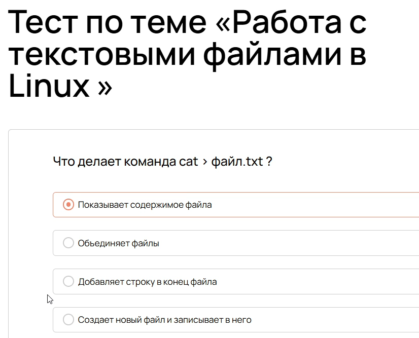{#fig:004 width=70%}

## Добавление в файл

**>>** - добавляет текст в конец файла

{#fig:005 width=70%}

## Просмотр файлов

**less** - постраничный просмотр больших файлов

{#fig:006 width=70%}

## Редактор Vim

**:** - переход в Command mode

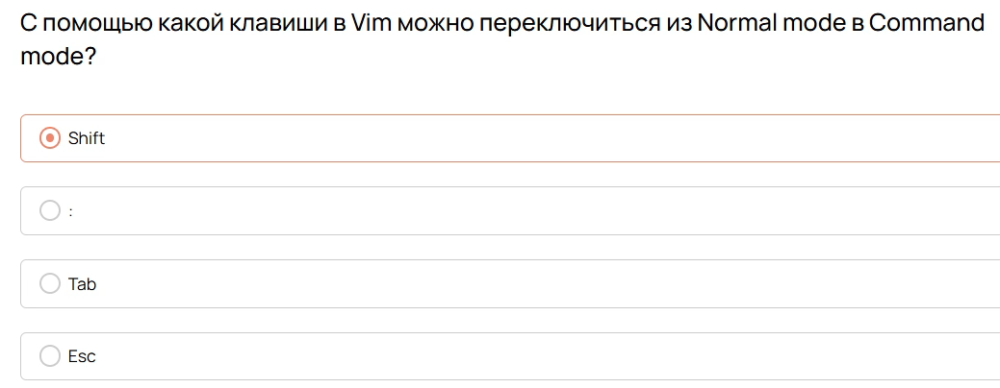{#fig:008 width=70%}

# Анализ системных логов

## Каталог логов

**/var/log** - основной каталог системных логов

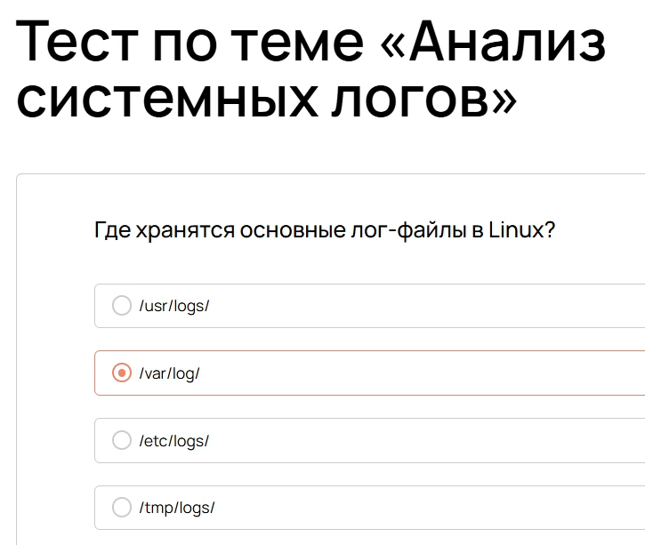{#fig:010 width=70%}

## Логи SSH

**journalctl -u sshd** - логи службы SSH

{#fig:011 width=70%}

## Последние записи

**journalctl -n 20** - последние 20 записей

{#fig:012 width=70%}

# Автоматизация анализа

## Мониторинг логов

**tail -f** - отслеживает новые строки

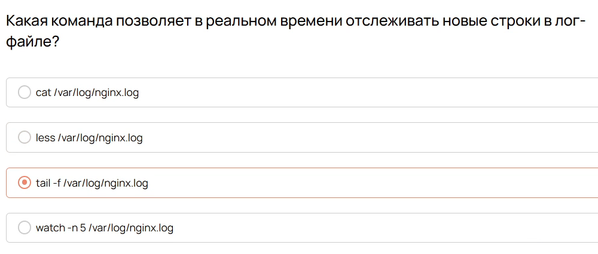{#fig:014 width=70%}

## Задания cron

**/var/spool/cron/** - пользовательские задания

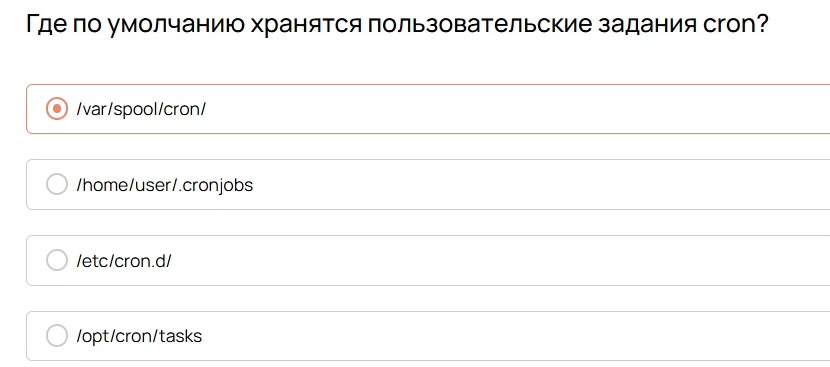{#fig:015 width=70%}

## Символы crontab

***** - означает «любое значение»

{#fig:016 width=70%}

# Управление пользователями

## Создание пользователя

**useradd -m** - с домашней директорией

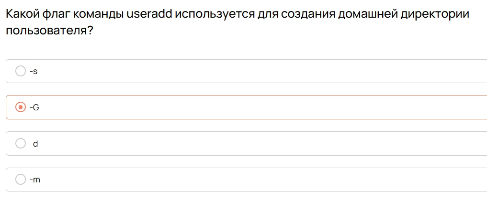{#fig:019 width=70%}

## Удаление пользователя

**userdel -r** - с удалением домашней директории

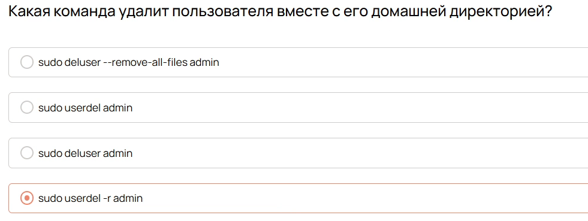{#fig:020 width=70%}

## Добавление в группу sudo

**usermod -aG sudo** - права администратора

{#fig:021 width=70%}

# Права доступа

## Просмотр прав

**ls -l** - показывает права доступа

{#fig:024 width=70%}

## Смена владельца

**chown user:group** - меняет владельца и группу

{#fig:025 width=70%}

## Числовые права

**754** = rwxr-xr--

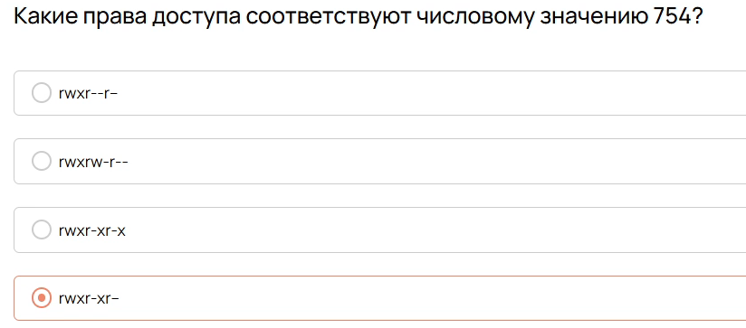{#fig:026 width=70%}

# Безопасность учетных записей

## Команда sudo

Выполнение с правами суперпользователя

{#fig:028 width=70%}

## Смена порта SSH

Требует обновления файрвола

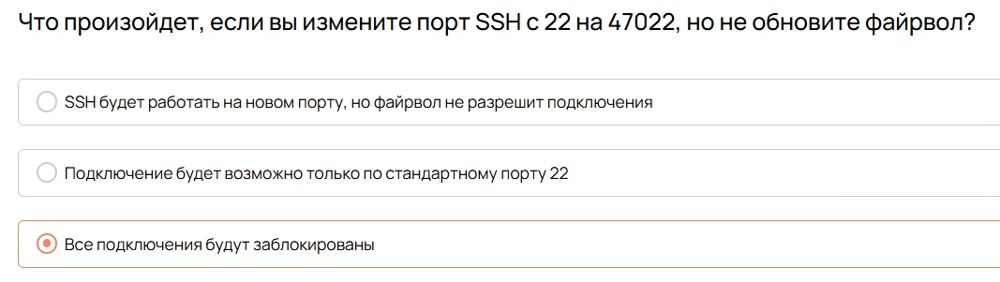{#fig:029 width=70%}

## Разрешение порта

**ufw allow порт/tcp** - добавление правила

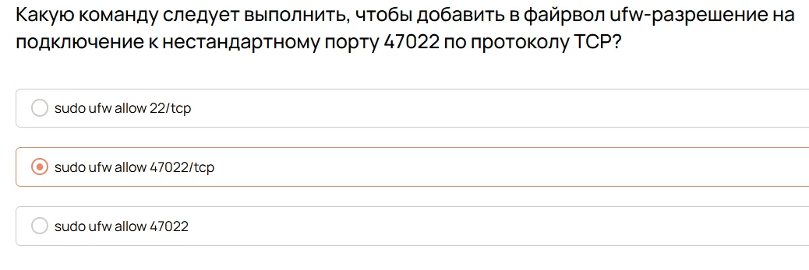{#fig:030 width=70%}

# Политика паролей

## Хеширование

Одностороннее криптографическое преобразование

{#fig:033 width=70%}

## Алгоритм хеширования

**$y** - указывает алгоритм (yescrypt)

{#fig:034 width=70%}

## Функция "соли"

Уникальная строка для каждого пароля

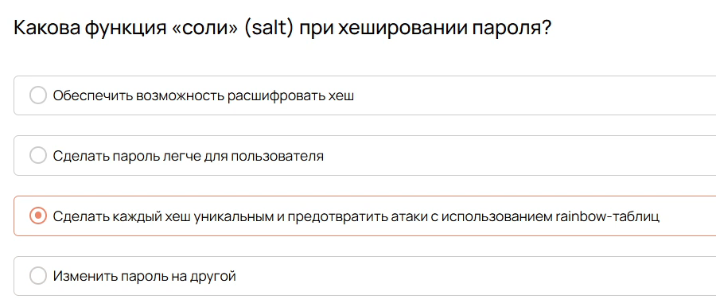{#fig:035 width=70%}

# Права доступа - команды

## Просмотр прав

**ls -l** - основные права доступа

{#fig:039 width=70%}

## Скрытые файлы

**ls -la** - показывает все файлы

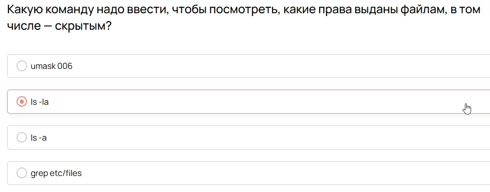{#fig:040 width=70%}

## Восьмеричный формат

**r w -** = **6** в восьмеричной системе

{#fig:041 width=70%}

# Изменение прав доступа

## Команда chmod

Изменяет права доступа

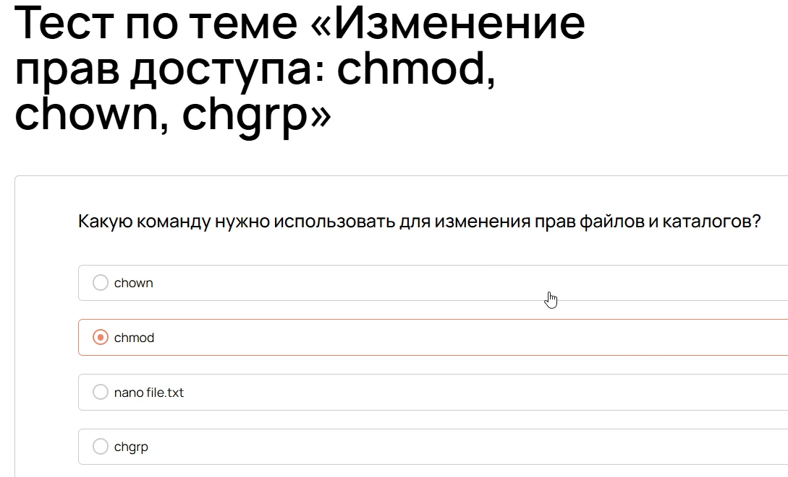{#fig:043 width=70%}

## Операторы chmod

**+ - =** - добавление, удаление, установка

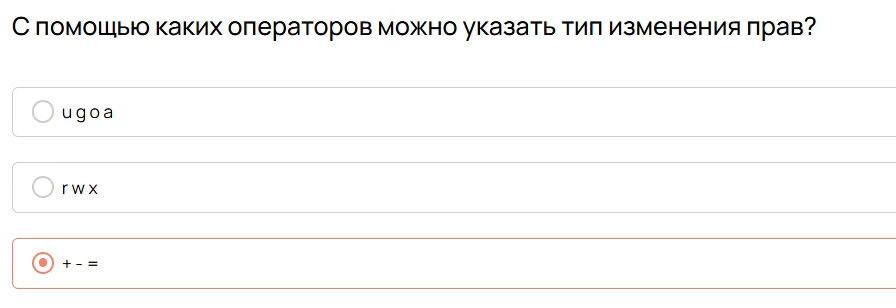{#fig:044 width=70%}

## Рекурсивное изменение

**-R** - для всех вложенных элементов

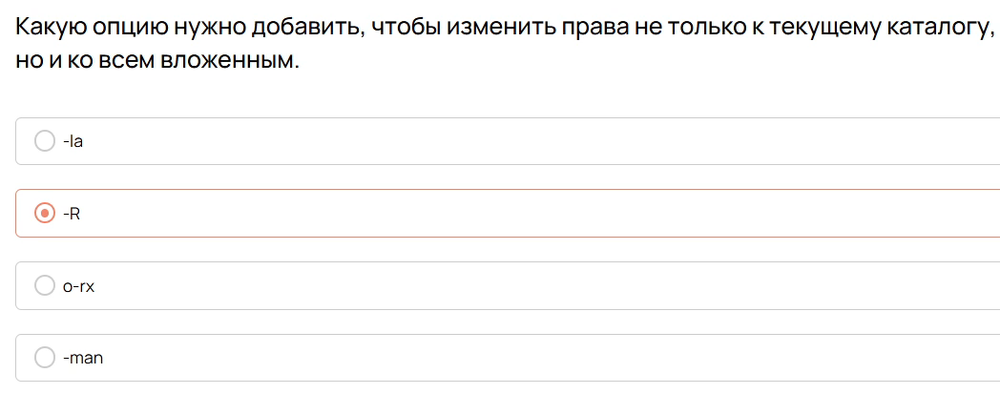{#fig:045 width=70%}

# Специальные разрешения

## Sticky Bit

Удаление файлов только владельцами

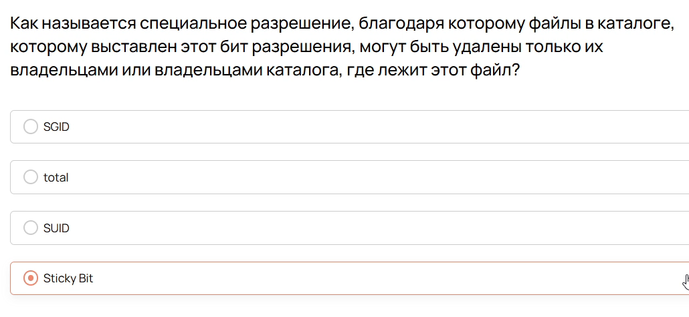{#fig:047 width=70%}

## SUID

Запуск от имени владельца файла

{#fig:048 width=70%}

## SGID

Запуск от имени владельца группы

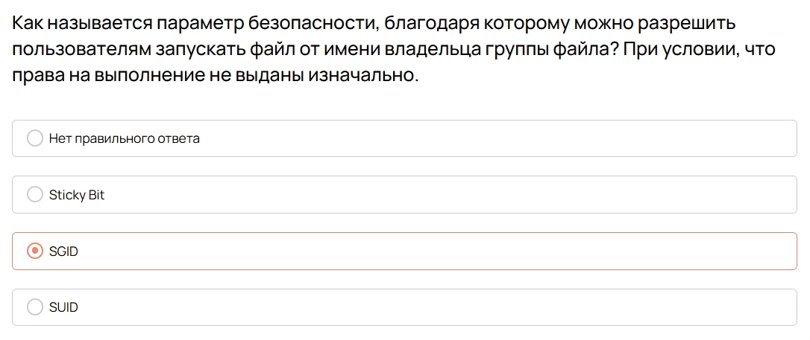{#fig:049 width=70%}

# Управление процессами

## Мониторинг процессов

**ps aux** - список всех процессов

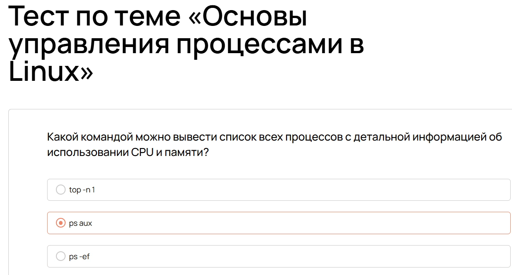{#fig:051 width=70%}

## Сигнал kill

**kill -9** - немедленное завершение

{#fig:052 width=70%}

## Приостановка процесса

**Ctrl+Z** - перевод в фон

{#fig:053 width=70%}

# Приоритеты процессов

## Значения nice

**-20** - наивысший приоритет

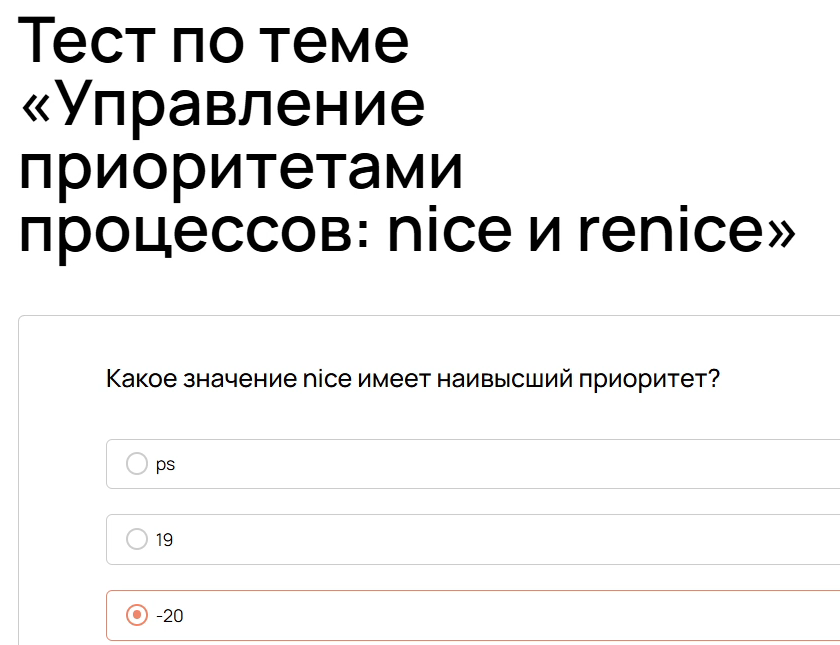{#fig:055 width=70%}

## Изменение приоритета

**renice** - для запущенных процессов

{#fig:056 width=70%}

## Приоритет в systemd

**CPUSchedulingPriority** - настройка приоритета

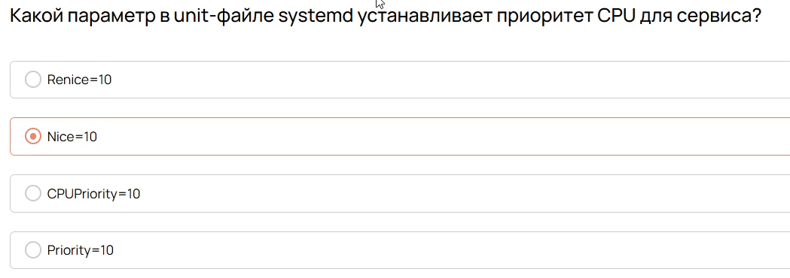{#fig:057 width=70%}

# Управление сервисами

## Проверка статуса

**systemctl status** - статус сервиса

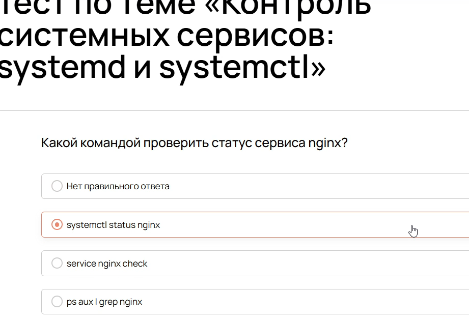{#fig:059 width=70%}

## Таймеры systemd

**OnCalendar=daily** - ежедневный запуск

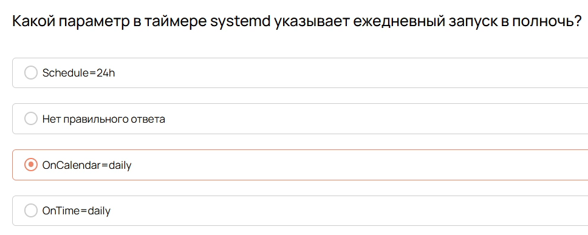{#fig:060 width=70%}

## Автозапуск сервиса

**systemctl enable** - включение автозапуска

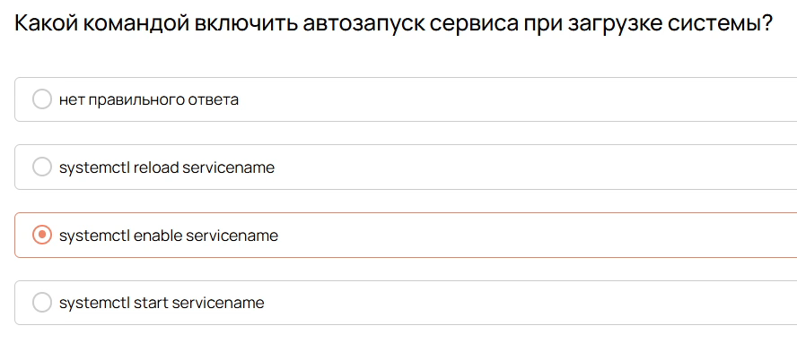{#fig:061 width=70%}

# Управление демонами

## Автоперезапуск

**Restart=always** - при любом завершении

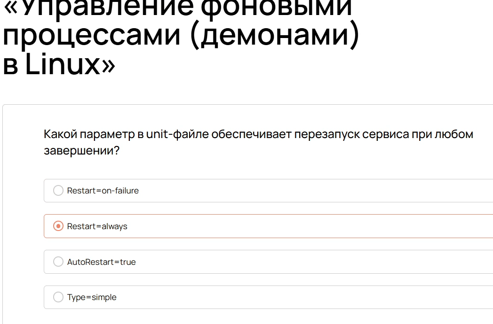{#fig:063 width=70%}

## Логи в реальном времени

**journalctl -f** - отслеживание логов

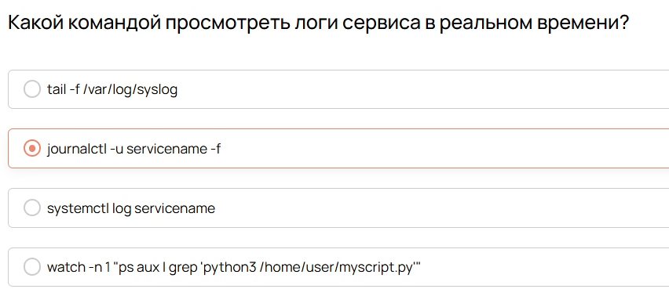{#fig:064 width=70%}

## Проверка синтаксиса

**systemd-analyze verify** - валидация unit-файла

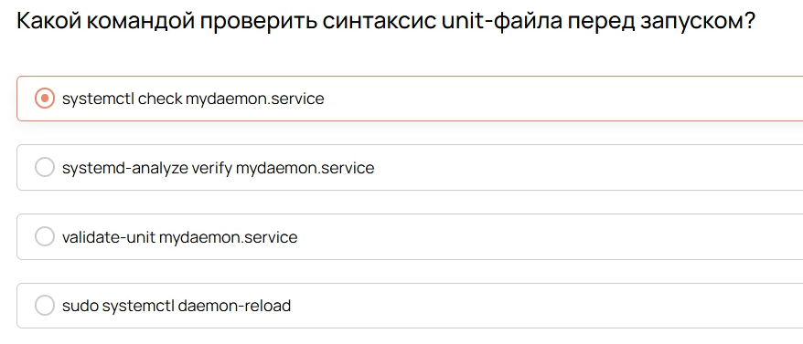{#fig:065 width=70%}

# Результаты обучения

## Успешное прохождение

Все тесты курса пройдены успешно

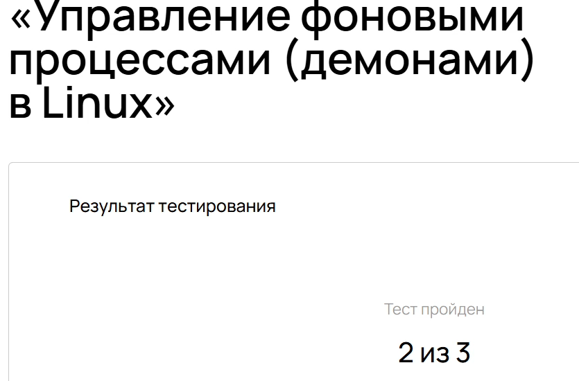{#fig:066 width=70%}

## Итоговые достижения

- Освоены основы системного администрирования
- Изучены команды работы с файлами
- Приобретены навыки управления процессами
- Освоено управление пользователями и правами
