---
## Front matter
title: "Отчёт по прохождению внешнего курса: Системный администратор Linux с нуля"
subtitle: "Часть 2"
author: "Аджигалиева Амина"

## Generic otions
lang: ru-RU
toc-title: "Содержание"

## Bibliography
bibliography: bib/cite.bib
csl: pandoc/csl/gost-r-7-0-5-2008-numeric.csl

## Pdf output format
toc: true # Table of contents
toc-depth: 2
lof: true # List of figures
fontsize: 12pt
linestretch: 1.5
papersize: a4
documentclass: scrreprt
## I18n polyglossia
polyglossia-lang:
  name: russian
  options:
	- spelling=modern
	- babelshorthands=true
polyglossia-otherlangs:
  name: english
## I18n babel
babel-lang: russian
babel-otherlangs: english
## Fonts
mainfont: IBM Plex Serif
romanfont: IBM Plex Serif
sansfont: IBM Plex Sans
monofont: IBM Plex Mono
mathfont: STIX Two Math
mainfontoptions: Ligatures=Common,Ligatures=TeX,Scale=0.94
romanfontoptions: Ligatures=Common,Ligatures=TeX,Scale=0.94
sansfontoptions: Ligatures=Common,Ligatures=TeX,Scale=MatchLowercase,Scale=0.94
monofontoptions: Scale=MatchLowercase,Scale=0.94,FakeStretch=0.9
mathfontoptions:
## Biblatex
biblatex: true
biblio-style: "gost-numeric"
biblatexoptions:
  - parentracker=true
  - backend=biber
  - hyperref=auto
  - language=auto
  - autolang=other*
  - citestyle=gost-numeric
## Pandoc-crossref LaTeX customization
figureTitle: "Рис."
tableTitle: "Таблица"
listingTitle: "Листинг"
lofTitle: "Список иллюстраций"
lolTitle: "Листинги"
## Misc options
indent: true
header-includes:
  - \usepackage{indentfirst}
  - \usepackage{float} # keep figures where there are in the text
  - \floatplacement{figure}{H} # keep figures where there are in the text
---

# Цель работы

Изучить основы системного администрирования и Linux

# Ход выполнения

## Поиск справочной информации в Линукс

Какая команда поможет узнать, как работает утилита grep?
man grep

{ #fig:001 width=70% }

Что делает команда info?
Открывает справку в формате info для заданной команды

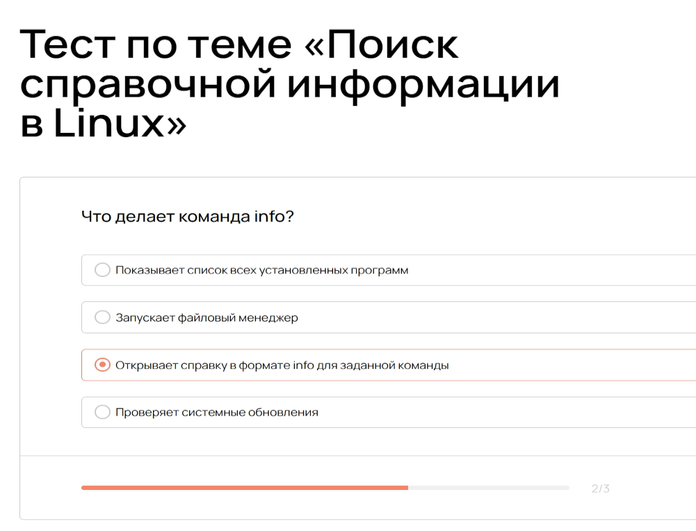{ #fig:002 width=70% }

Где чаще всего находятся текстовые справочные файлы (документация) к установленным программам в Linux?
/usr/share/doc

{ #fig:003 width=70% }

## Работа с текстовыми файлами в Linux

Что делает команда cat > файл.txt ?

{ #fig:004 width=70% }

Чем отличается cat >> файл.txt от cat > файл.txt?

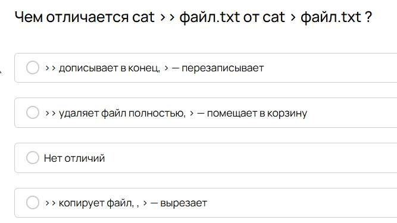{ #fig:005 width=70% }

Чем less отличается от cat при просмотре больших файлов?

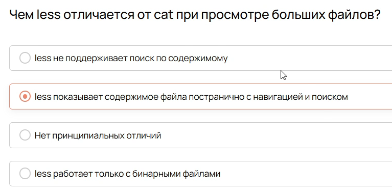{ #fig:006 width=70% }

Какой клавишей можно выйти из утилиты less?

{ #fig:007 width=70% }

С помощию какой клавиши в Vim можно переключиться из Normal mode в Command mode?

{ #fig:008 width=70% }

{ #fig:009 width=70% }

## Анализ системных логов

Где хранятся основные лог файлы? 

{ #fig:010 width=70% }

Что делает команда journalctl -u sshd -- since today?

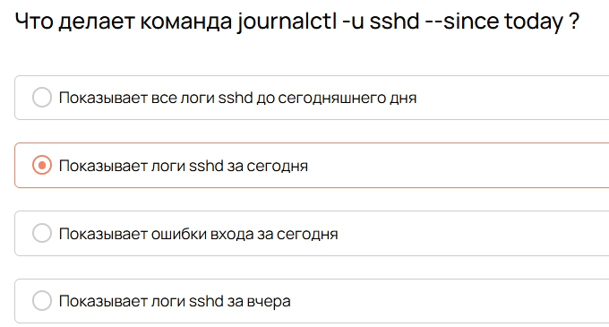{ #fig:011 width=70% }

Какой параметр journalctl показывает последние 20 записей?

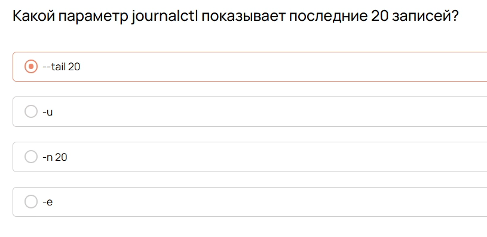{ #fig:012 width=70% }

{ #fig:013 width=70% }

## Автоматизация анализа логов и работы с текстом

Какая команда позволяет в реальном времени отслеживать новые строки в лог-
файле?

{ #fig:014 width=70% }

Где по умолчанию хранятся пользовательские задания cron?

{ #fig:015 width=70% }

Какой символ в crontab означает «любое значение»?

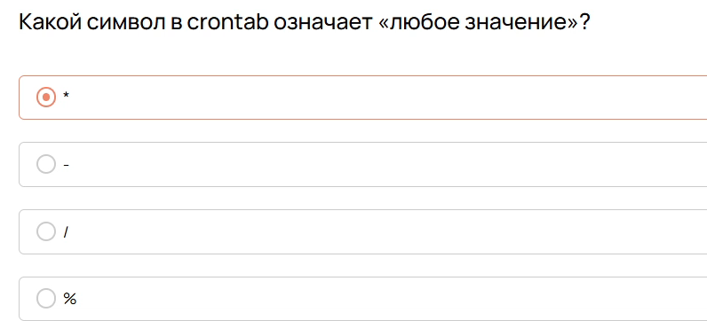{ #fig:016 width=70% }

Как удалить все задания cron для текущего пользователя?

{ #fig:017 width=70% }

{ #fig:018 width=70% }
 
## Основы управления пользователями и группами

Какой флаг команды useradd используется для создания домашней директории
пользователя?

{ #fig:019 width=70% }
 
Какая команда удалит пользователя вместе с его домашней дирикторией?

{ #fig:020 width=70% }
 
Что делает команда sudo usermod -aG sudo admin?

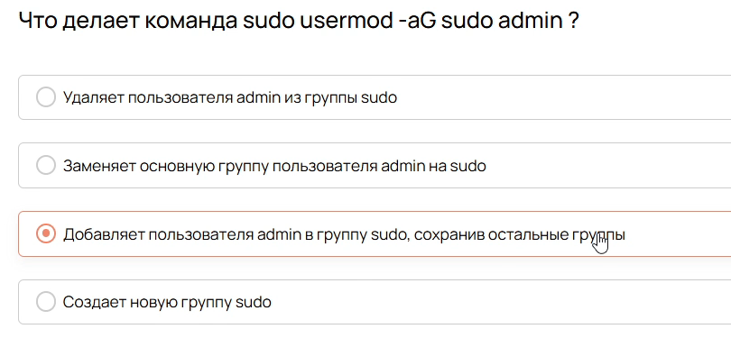{ #fig:021 width=70% }

Какая команда используется для безопасного редактирования файла /etc/passwd ?

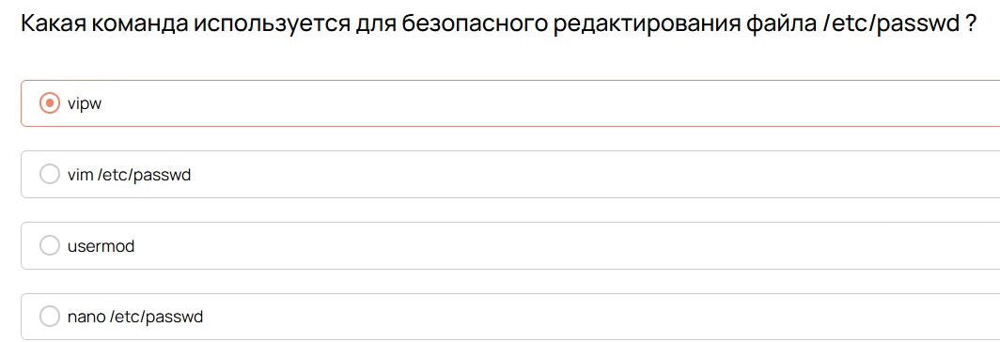{ #fig:022 width=70% }

{ #fig:023 width=70% }
 
## Основы управления доступом и разрешениями

Что означает первый символ d в строке прав доступа при выполнении команды ls -l?

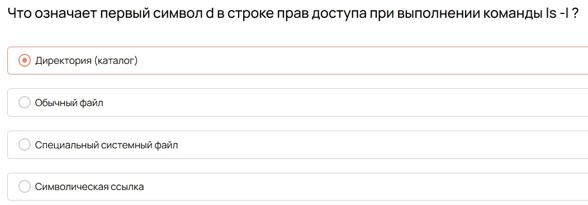{ #fig:024 width=70% }

Какая команда сменит владельца и группу файла /home/ivan/file.txt нa ivan и friends
соответственно?

{ #fig:025 width=70% }

Какие права доступа соответствуют числовому значению 754?

{ #fig:026 width=70% }

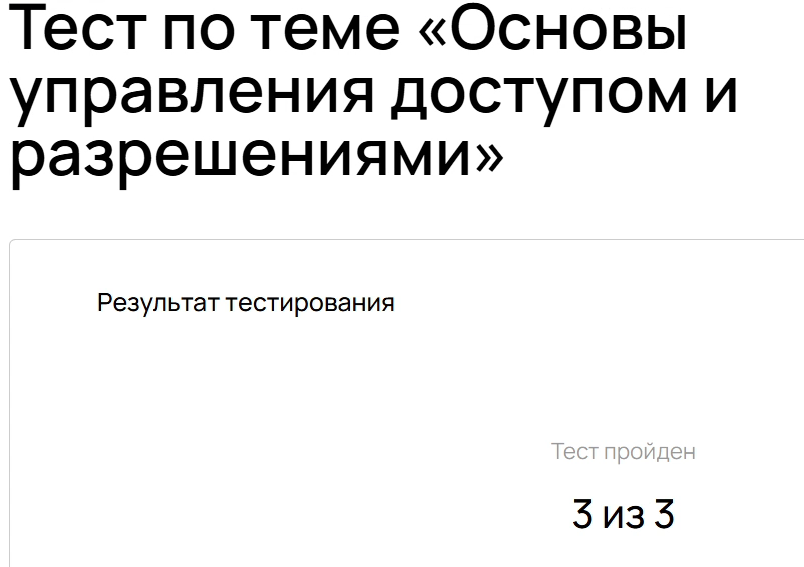{ #fig:027 width=70% }

## Повышение безопасности работы с учетными записями

Что произойдет, если вы используете команду sudo для выполнения действий?

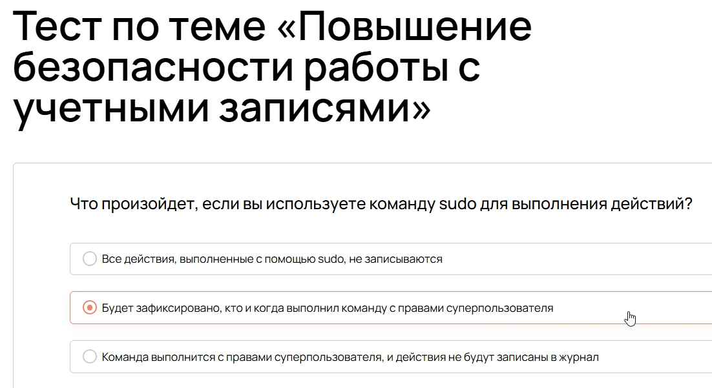{ #fig:028 width=70% }

Что произойдет, если вы измените порт SSH с 22 на 47022, но не обновите файрвол?

{ #fig:029 width=70% }

Какую команду следует выполнить, чтобы добавить в файрвол ufw-разрешение на
подключение к нестандартному порту 47022 по протоколу TСР?

{ #fig:030 width=70% }

Почему рекомендуется использовать sudo, a нe su?

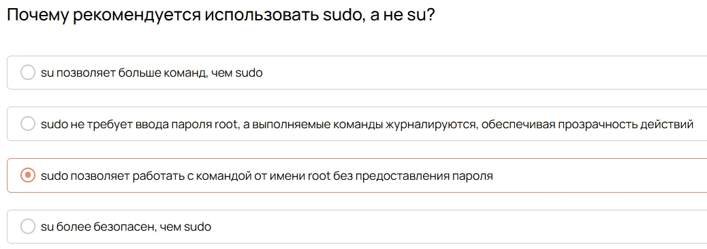{ #fig:031 width=70% }

{ #fig:032 width=70% }

## Политика паролей и учетных записей

Какой из следующих вариантов наиболее точно описывает хеширование пароля?

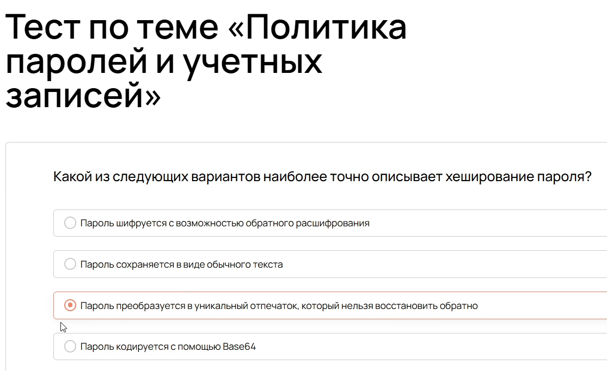{ #fig:033 width=70% }

Что обозначает первая часть строки пароля в /etc/shadow, которая начинается с
символа $ (например, $y)?

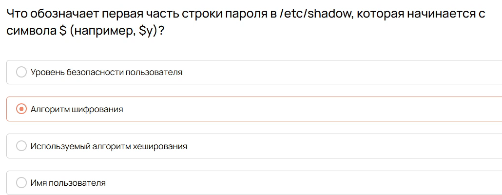{ #fig:034 width=70% }

Какова функция «соли» (salt) при хешировании пароля?

{ #fig:035 width=70% }

Какая команда позволяет просмотреть текущие параметры политики пароля для
пользователя ivan?

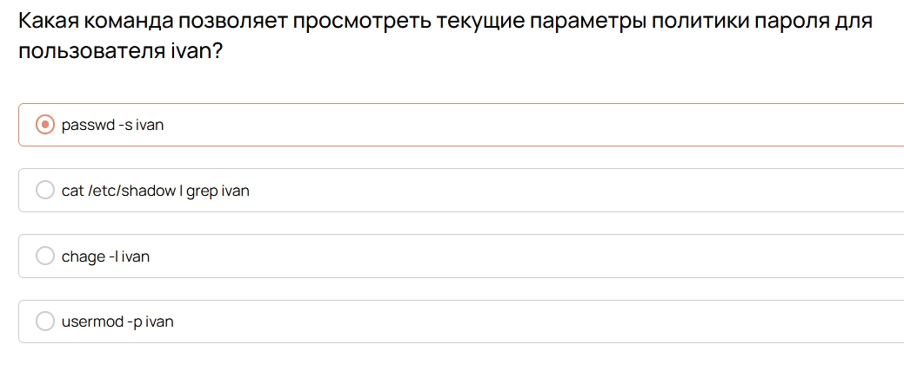{ #fig:036 width=70% }

Что произойдет после выполнения команды sudo usermod -Lusername?

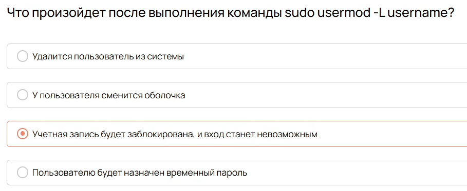{ #fig:037 width=70% }

{ #fig:038 width=70% }

## Что такое права доступа в Linux

Какую команду надо ввести, чтобы посмотреть, какие права выданы файлам?

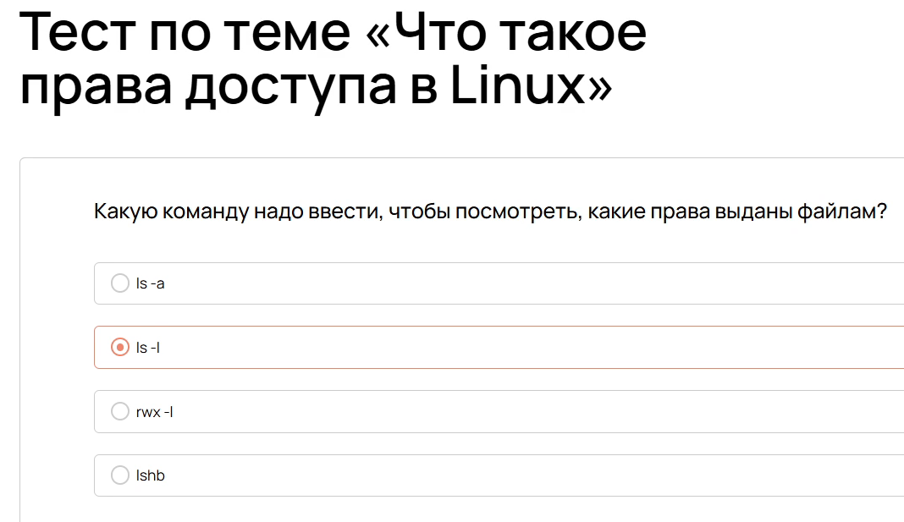{ #fig:039 width=70% }

Какую команду надо ввести, чтобы посмотреть, какие права выданы файлам, в том
числе - скрытым?

{ #fig:040 width=70% }

Как будут записаны права r w - в восьмеричном формате?

{ #fig:041 width=70% }

{ #fig:042 width=70% }

## Изменение прав доступа: chmod, chown, chgrp

Какую команду нужно использовать для изменения прав файлов и каталогов?

{ #fig:043 width=70% }

С помощью каких операторов можно указать тип изменения прав?

{ #fig:044 width=70% }

Какую опцию нужно добавить, чтобы изменить права не только к текущему каталогу,
но и ко всем вложенным.

{ #fig:045 width=70% }

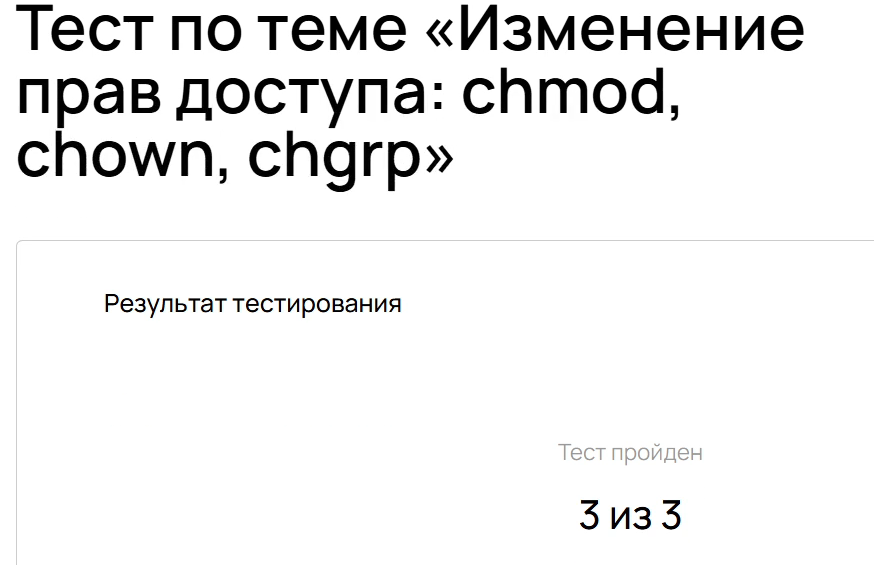{ #fig:046 width=70% }

## Специальные разрешения: SUID, SGID, Sticky Bit

Как называется специальное разрешение, благодаря которому файлы в каталоге,
которому выставлен этот бит разрешения, могут быть удалены только их
владельцами или владельцами каталога, где лежит этот файл?

{ #fig:047 width=70% }

Как называется параметр безопасности, благодаря которому можно разрешить
пользователям запускать программу от имени владельца? При условии, что права на
выполнение выданы изначально.

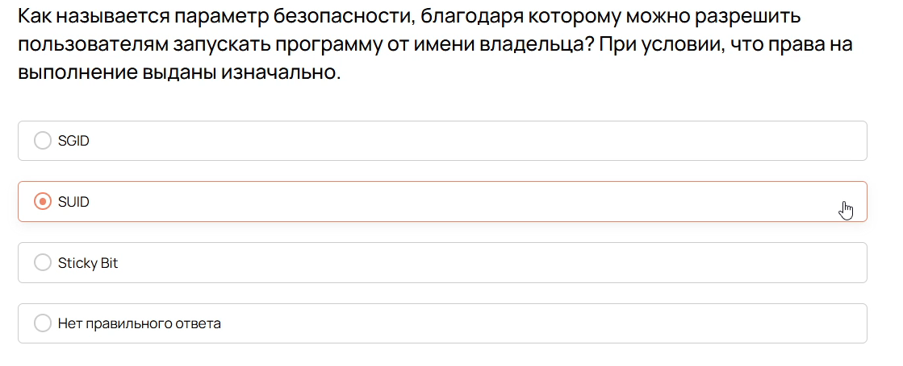{ #fig:048 width=70% }

Как называется параметр безопасности, благодаря которому можно разрешить
пользователям запускать файл от имени владельца группы файла? При условии, что
права на выполнение не выданы изначально.

{ #fig:049 width=70% }

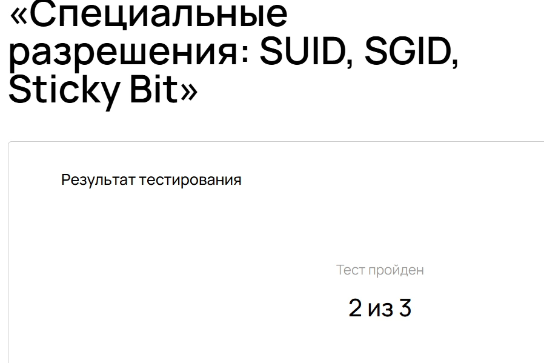{ #fig:050 width=70% }

## Основы управления процессами в Linux

Какой командой можно вывести список всех процессов с детальной информацией об
использовании СРU и памяти?

{ #fig:051 width=70% }

Какой сигнал отправляется процессу командой kill -9?

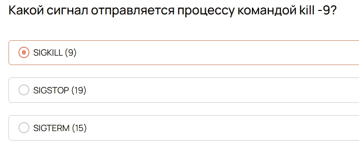{ #fig:052 width=70% }

Какой командой можно приостановить выполнение процесса и перевести его в фон?

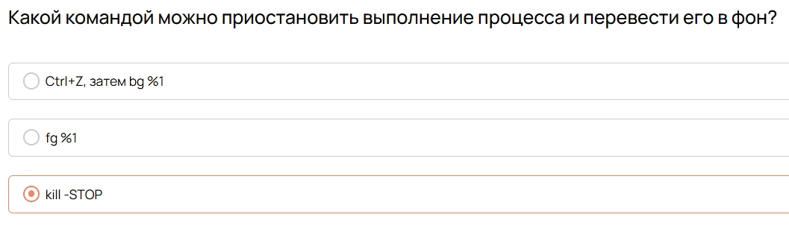{ #fig:053 width=70% }

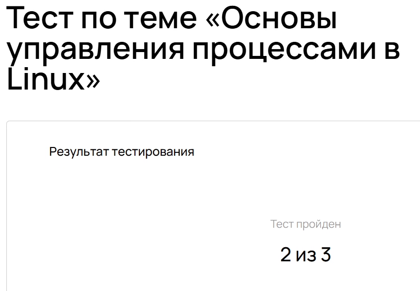{ #fig:054 width=70% }

## Управление приоритетами процессов: nice и renice

Какое значение nice имеет наивысший приоритет?

{ #fig:055 width=70% }

Какой командой изменить приоритет уже запущенного процесса с PID 1234 на
nice=10?

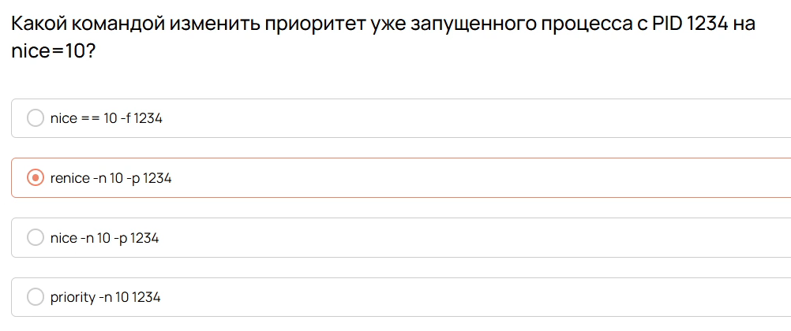{ #fig:056 width=70% }

Какой параметр в unit-файле systemd устанавливает приоритет CPU для сервиса?

{ #fig:057 width=70% }

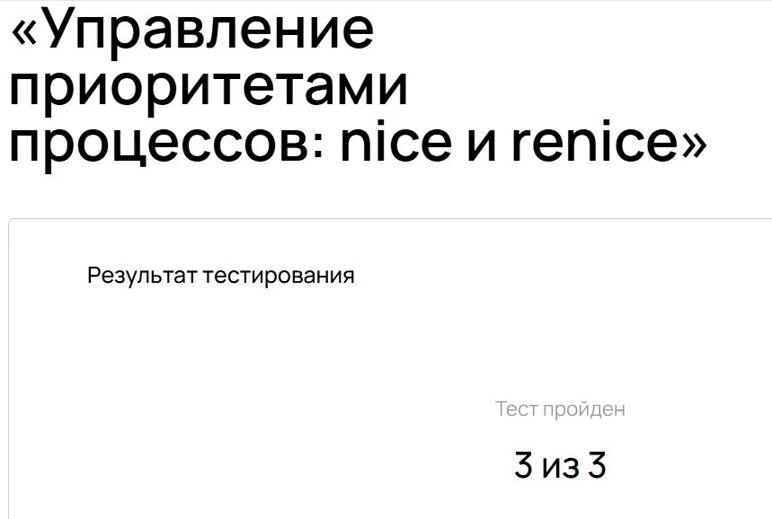{ #fig:058 width=70% }

## Контроль системных сервисов: systemd и systemctl

Какой командой проверить статус сервиса nginx?

{ #fig:059 width=70% }

Какой параметр в таймере systemd указывает ежедневный запуск в полночь?

{ #fig:060 width=70% }

Какой командой включить автозапуск сервиса при загрузке системы?

{ #fig:061 width=70% }

{ #fig:062 width=70% }

## Управление фоновыми процессами (демонами) B Linux

Какой параметр в unit-файле обеспечивает перезапуск сервиса при любом
завершении?

{ #fig:063 width=70% }

Какой командой просмотреть логи сервиса в реальном времени?

{ #fig:064 width=70% }

Какой командой проверить синтаксис unit-файла перед запуском?

{ #fig:065 width=70% }

{ #fig:066 width=70% }

# Заключение

Освоили основы администрирования

