---
## Front matter
lang: ru-RU
title: Внешний курс. Часть 3
author:
  - Аджигалиева Амина Руслановна
institute:
  - Российский университет дружбы народов, Москва, Россия
date: 20 ноября 2025

## i18n babel
babel-lang: russian
babel-otherlangs: english

## Formatting pdf
toc: false
toc-title: Содержание
slide_level: 2
aspectratio: 169
section-titles: true
theme: metropolis
header-includes:
 - \metroset{progressbar=frametitle,sectionpage=progressbar,numbering=fraction}
---

# Цель работы

Изучить основы системного администрирования и Linux

Освоение сетевых технологий, безопасности и контейнеризации

# Основы сетевой конфигурации

## Назначение IP-адреса

**ip a add 192.168.122.2/24 dev eth0** - ручное назначение IP

{#fig:001 width=70%}

## Автозапуск интерфейса

**auto eth0** - поднимает интерфейс при загрузке

{#fig:002 width=70%}

## Удаление IP-адреса

**ip a del 192.168.122.2/24 dev eth0** - удаление IP

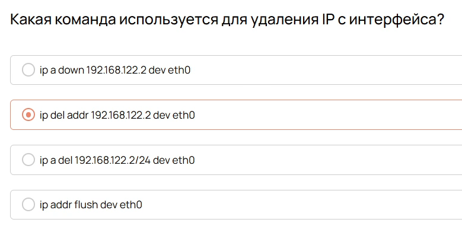{#fig:003 width=70%}

# Сетевая диагностика

## Просмотр открытых портов

**ss -tulnp** - показывает TCP-порты и процессы

{#fig:007 width=70%}

## DNS-запросы

**dig** - выполнение DNS-запросов

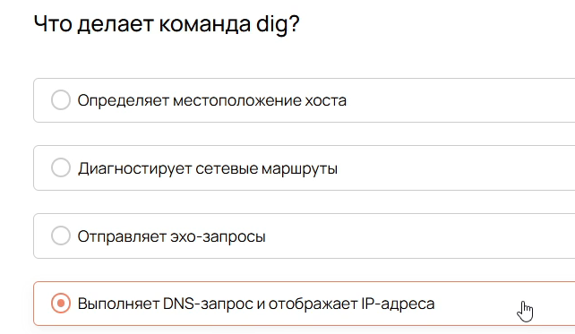{#fig:009 width=70%}

## Проверка портов

**nc -vz** - проверка TCP-подключения

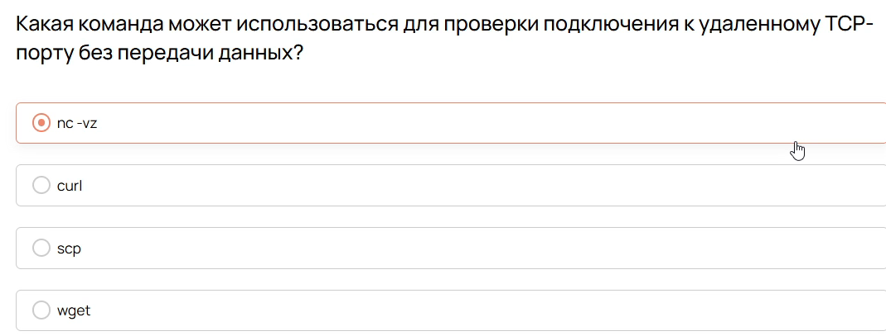{#fig:010 width=70%}

# Безопасность SSH

## Порт SSH по умолчанию

**22** - стандартный порт SSH

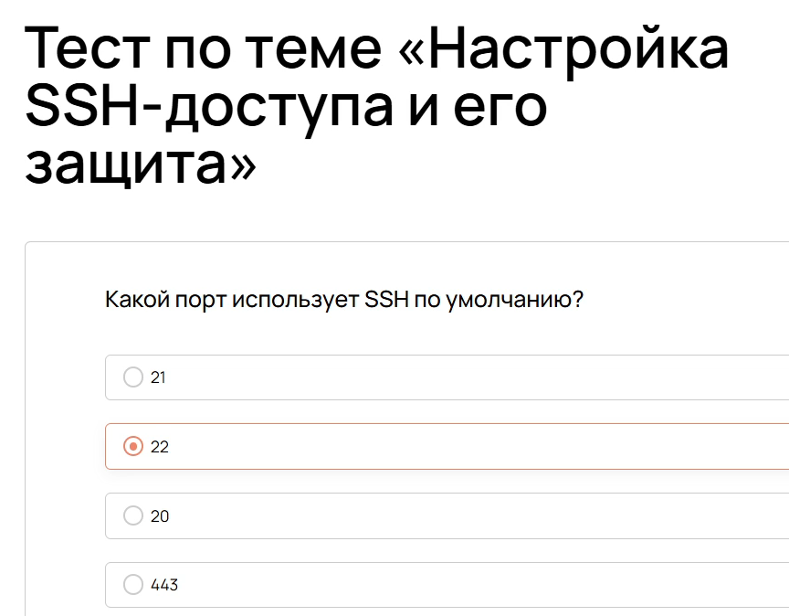{#fig:012 width=70%}

## Конфигурация SSH

**/etc/ssh/sshd_config** - основной конфиг файл

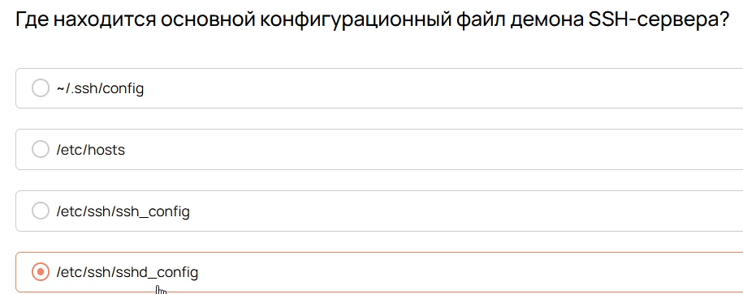{#fig:013 width=70%}

## Остановка SSH-сервиса

**systemctl stop ssh** - временная остановка

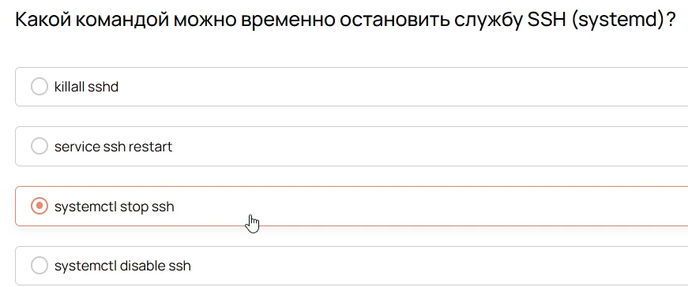{#fig:014 width=70%}

# Управление пакетами

## Структура пакетов

Изучение устройства пакетов в Linux

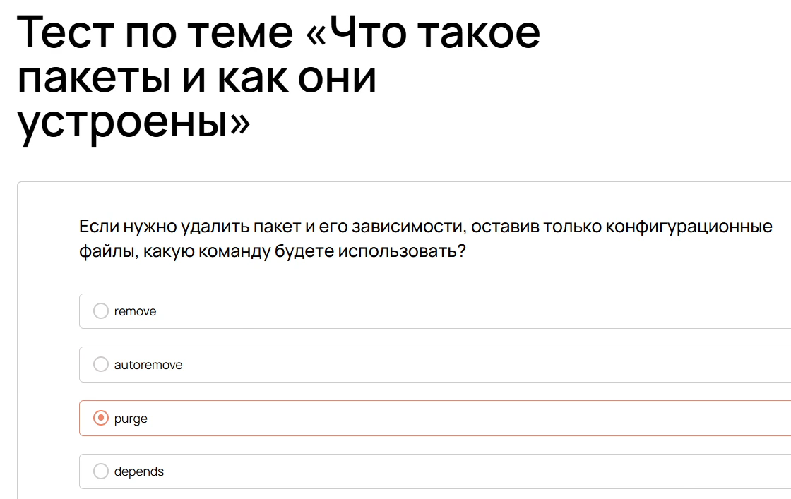{#fig:024 width=70%}

## Обновление системы

Команды для обновления пакетов

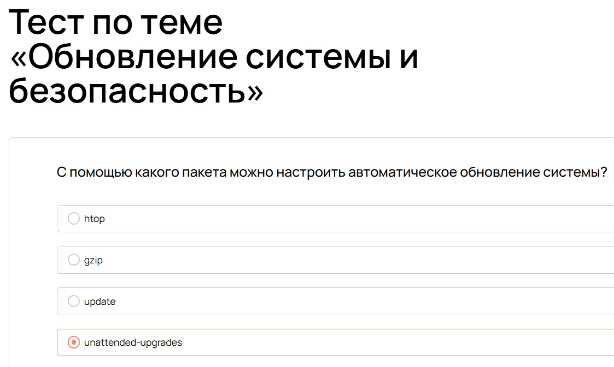{#fig:028 width=70%}

## Разрешение зависимостей

Решение конфликтов пакетов

{#fig:032 width=70%}

# Работа с логами

## Основы логирования

Изучение системы логов в Linux

{#fig:040 width=70%}

## Система journalctl

Работа с системными логами

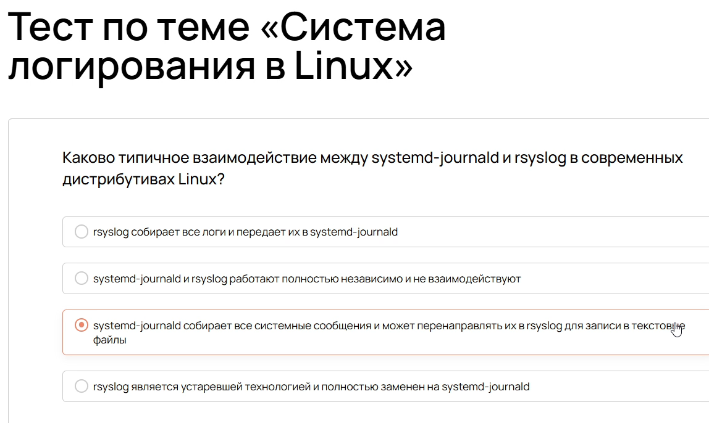{#fig:044 width=70%}

## Фильтрация логов

Поиск и фильтрация лог-записей

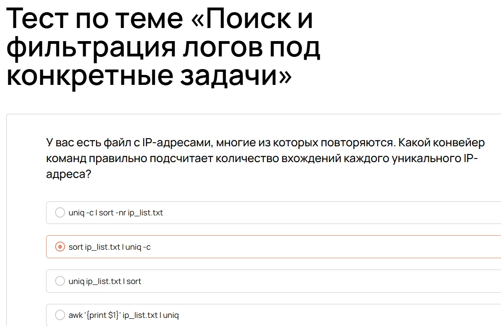{#fig:048 width=70%}

# Расследование инцидентов

## Анализ логов

Исследование инцидентов безопасности

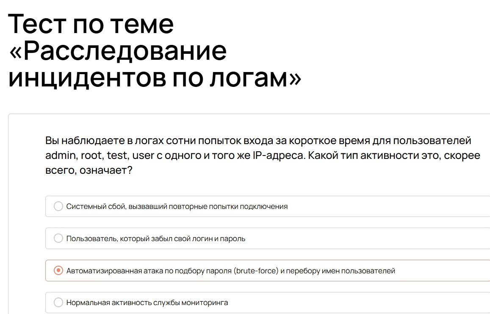{#fig:052 width=70%}

## Ротация логов

Управление жизненным циклом лог-файлов

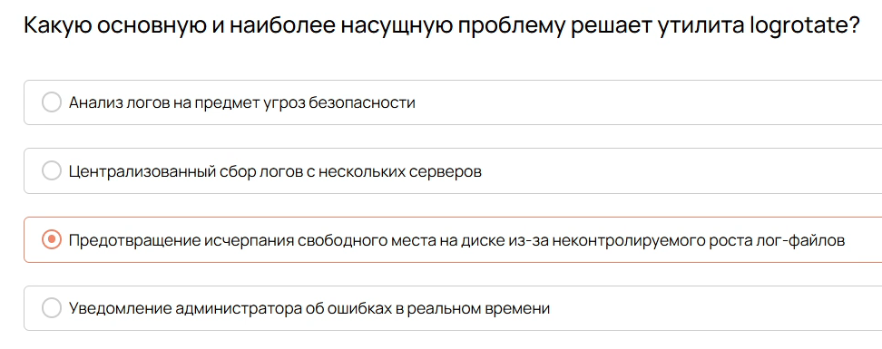{#fig:056 width=70%}

# Контейнеризация

## Основы контейнеризации

Изучение принципов контейнеризации

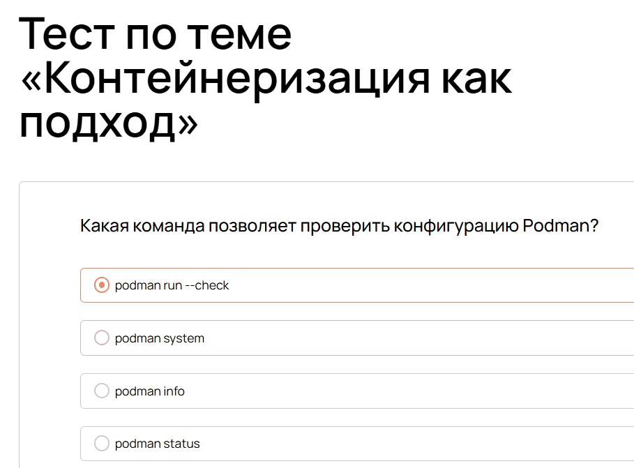{#fig:060 width=70%}

## Работа с Podman

Управление контейнерами в Podman

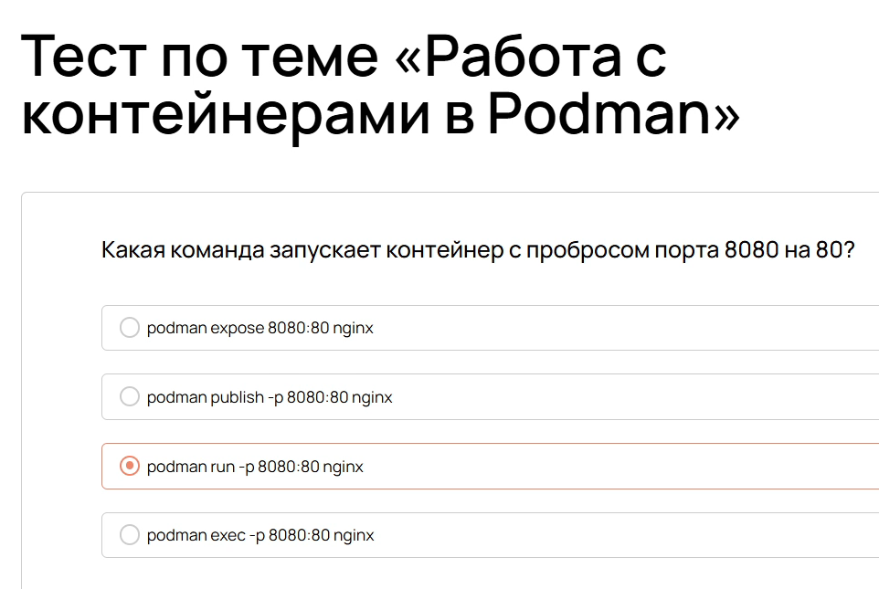{#fig:066 width=70%}

## Управление ресурсами

Контроль ресурсов контейнеров

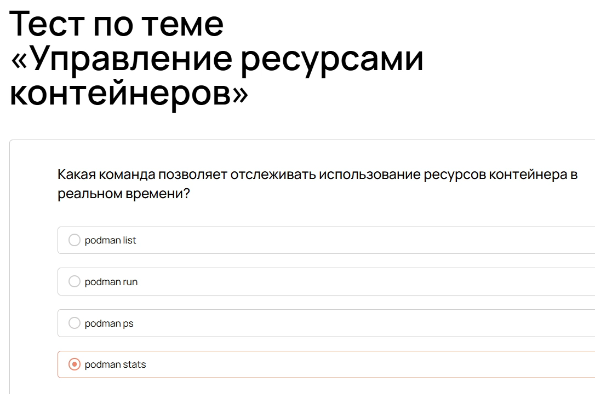{#fig:072 width=70%}

# Безопасность контейнеров

## Образы и реестры

Работа с Docker-образами

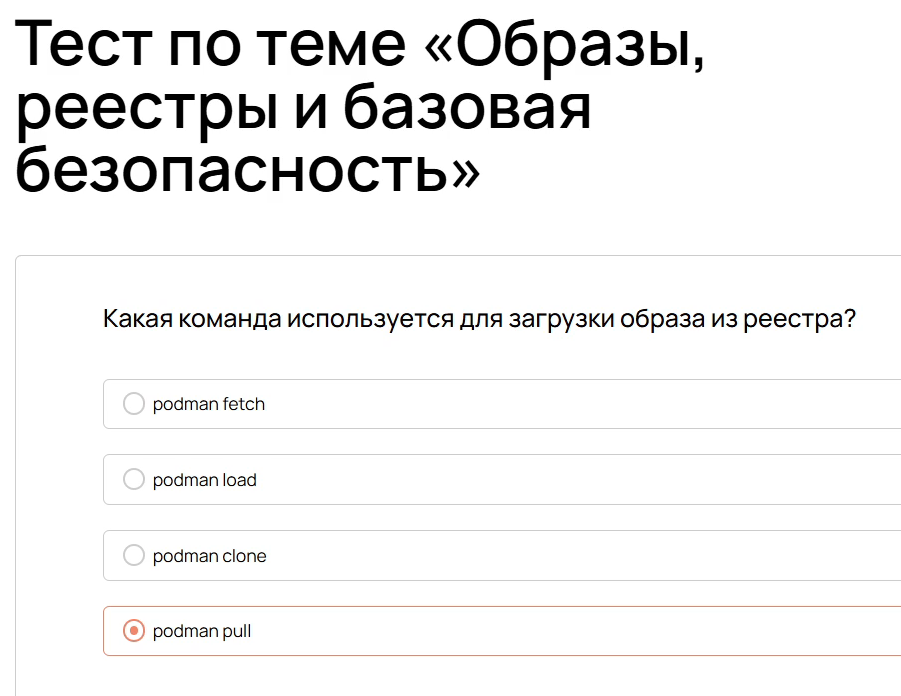{#fig:078 width=70%}

## Безопасность контейнеров

Основы безопасной работы с контейнерами

{#fig:079 width=70%}

# Результаты обучения

## Успешное прохождение

Все тесты курса пройдены успешно

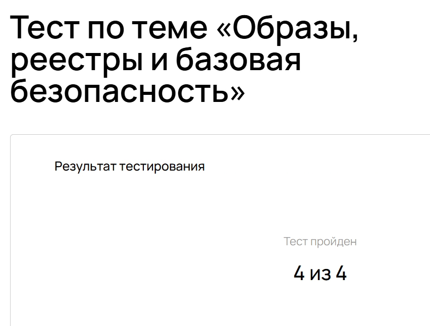{#fig:082 width=70%}

## Итоги курса

- Освоены основы сетевой конфигурации
- Изучена диагностика сети
- Приобретены навыки безопасности SSH
- Освоено управление пакетами
- Изучена работа с системными логами
- Освоены основы контейнеризации

