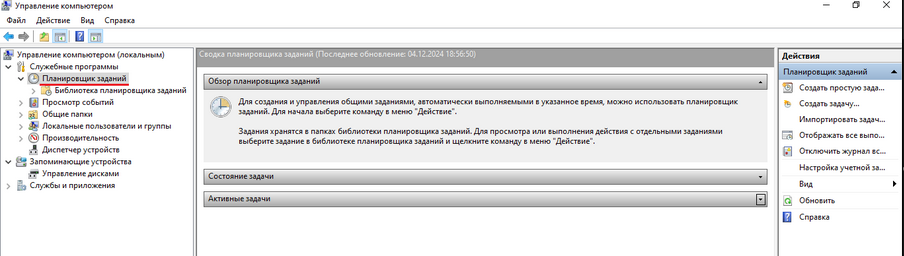
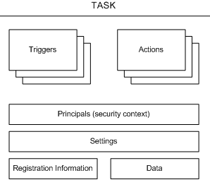

---
## Front matter
lang: ru-RU
title: Планировщики заданий Windows
author:
  - Аджигалиева Амина Руслановна
institute:
  - Российский университет дружбы народов, Москва, Россия
date: 10 октября 2025
lecturer: 
  - Кулябов Дмитрий Сергеевич 
  - Профессор кафедры прикладной информатики и теории вероятностей РУДН.
  - Доктор физико-математических наук.
  - Доцент по кафедре систем телекоммуникаций

## i18n babel
babel-lang: russian
babel-otherlangs: english

## Formatting pdf
toc: false
toc-title: Содержание
slide_level: 2
aspectratio: 169
section-titles: true
theme: metropolis
header-includes:
 - \metroset{progressbar=frametitle,sectionpage=progressbar,numbering=fraction}
---

## Актуальность

Планировщики заданий являются критически важным компонентом современных операционных систем Windows. Их актуальность обусловлена:
- Распространением автоматизации в IT-инфраструктурах
- Необходимостью эффективного управления ресурсами в корпоративных средах
- Повышением требований к безопасности и надежности системPortage предлагает уникальные возможности кастомизации, недоступные в других дистрибутивах.  
Изучение его архитектуры важно для понимания современных тенденций в разработке пакетных менеджеров.  

## Цель

Исследовать механизмы функционирования планировщика задач Windows.

## Планировщик заданий

Планировщик заданий (англ. Task Scheduler) — компонент Microsoft Windows, который предоставляет возможность запланировать запуск программ или скриптов в определённые моменты времени или через заданные временные интервалы. 

{.column width="30%"}

Основные функции программного обеспечения планировщика заданий включают в себя:  
- интерфейсы, которые помогают определить рабочие процессы и/или зависимости между заданиями;  
- автоматический запуск заданий на выполнение;  
- интерфейсы для отслеживания выполнения заданий;  
- приоритеты и/или очереди для контроля порядка выполнения независимых заданий.  

## Где установлен планировщик задач

Планировщик задач автоматически устанавливается с несколькими операционными системами Майкрософт.  

Планировщик задач 1.0 устанавливается с операционными системами Windows Server 2003, Windows XP и Windows 2000.  

Планировщик задач 2.0 установлен с Windows Vista и Windows Server 2008.  

Планировщик задач запускается при каждом запуске операционной системы. Его можно запустить через графический пользовательский интерфейс планировщика задач (GUI) или через API планировщика задач, описанный в пакете SDK.  

{.column width="30%"}

## Задания

Задача — это запланированная работа, выполняемая службой планировщика задач. Задача состоит из различных компонентов, но задача должна содержать триггер, который планировщик задач использует для запуска задачи, и действие, описывающее, какую работу будет выполнять планировщик задач.

## Компоненты задачи

{.column width="30%"}

Компоненты задачи: триггеры, действия, субъекты, параметры, сведения о регистрации, данные

## Действия задачи задачи

Типы действий 

{.column width="50%"}

Указание действий  
Действия задачи задаются, когда задача определена и хранится в коллекции действий, используемых службой планировщика задач. В следующей таблице перечислены ссылки на справочные разделы для API и XML-элементов, связанных с действиями.

## Сведения о регистрации

Сведения о регистрации обычно указываются при создании задачи, а затем используются следующими способами:  

Отображается в пользовательском интерфейсе планировщика задач.  
Получение или установка с помощью приложений или скриптов C++.  
В корпоративной среде используется в качестве условий поиска при перечислении всех зарегистрированных задач.  

Сведения о регистрации задач определяются свойствами объекта для сценариев приложений, свойствами интерфейса для приложений C++ и дочерними элементами элемента для чтения или записи XML.  

## Выводы

Планировщик заданий Windows представляет собой мощный инструмент автоматизации, эволюционировавший в комплексную систему управления задачами. Его эффективное использование требует глубокого понимания архитектуры, механизмов безопасности и лучших практик. Исследование демонстрирует значительный потенциал для оптимизации IT-процессов при условии корректной настройки и соблюдения принципов безопасности

