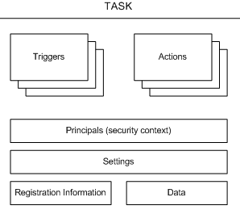

---
## Front matter
title: "Реферат по  Основам администрирования оc"
subtitle: "Планировщики заданий Windows"
author: "Аджигалиева Амина Руслановна"

## Generic otions
lang: ru-RU
toc-title: "Содержание"

## Bibliography
bibliography: bib/cite.bib
csl: pandoc/csl/gost-r-7-0-5-2008-numeric.csl

## Pdf output format
toc: true # Table of contents
toc-depth: 2
lof: true # List of figures
fontsize: 12pt
linestretch: 1.5
papersize: a4
documentclass: scrreprt
## I18n polyglossia
polyglossia-lang:
  name: russian
  options:
	- spelling=modern
	- babelshorthands=true
polyglossia-otherlangs:
  name: english
## I18n babel
babel-lang: russian
babel-otherlangs: english
## Fonts
mainfont: IBM Plex Serif
romanfont: IBM Plex Serif
sansfont: IBM Plex Sans
monofont: IBM Plex Mono
mathfont: STIX Two Math
mainfontoptions: Ligatures=Common,Ligatures=TeX,Scale=0.94
romanfontoptions: Ligatures=Common,Ligatures=TeX,Scale=0.94
sansfontoptions: Ligatures=Common,Ligatures=TeX,Scale=MatchLowercase,Scale=0.94
monofontoptions: Scale=MatchLowercase,Scale=0.94,FakeStretch=0.9
mathfontoptions:
## Biblatex
biblatex: true
biblio-style: "gost-numeric"
biblatexoptions:
  - parentracker=true
  - backend=biber
  - hyperref=auto
  - language=auto
  - autolang=other*
  - citestyle=gost-numeric
## Pandoc-crossref LaTeX customization
figureTitle: "Рис."
tableTitle: "Таблица"
listingTitle: "Листинг"
lofTitle: "Список иллюстраций"
lolTitle: "Листинги"
## Misc options
indent: true
header-includes:
  - \usepackage{indentfirst}
  - \usepackage{float} # keep figures where there are in the text
  - \floatplacement{figure}{H} # keep figures where there are in the text
---
# Введение

Планировщик заданий (англ. Task Scheduler) — компонент Microsoft Windows, который предоставляет возможность запланировать запуск программ или скриптов в определённые моменты времени или через заданные временные интервалы. Компонент впервые появился в Windows 95 Plus! pack под названием System Agent, но был переименован в Task Scheduler в Windows 98. Данный сервис для запуска требует включённого Event Log service.  (рис. [-@fig:001]).

{#fig:001 width=50%}

## Актуальность темы

Планировщики заданий являются критически важным компонентом современных операционных систем Windows. Их актуальность обусловлена:
- Распространением автоматизации в IT-инфраструктурах
- Необходимостью эффективного управления ресурсами в корпоративных средах
- Повышением требований к безопасности и надежности систем

## Объект и предмет исследования

Объект исследования: Система планирования заданий в операционных системах Windows  
Предмет исследования: Архитектура, функциональные возможности и практическое применение планировщика заданий Windows (Task Scheduler) в современных версиях ОС  

## Научная новизна

Предложение новых подходов к защите механизмов планировщика задач от скрытого вмешательства и манипуляций метаданными.  
Разработка методики анализа поведения планировщика в динамике (встроенные задачи, сторонние, злоумышленнические) и выявления аномалий.  
Сравнительный анализ новых уязвимостей планировщика Windows и контрмер, предложенных в литературе, с экспериментальной проверкой на современных версиях ОС.  

## Практическая значимость

Улучшение безопасности систем Windows за счёт внедрения механизмов обнаружения скрытых задач и предотвращения атак через планировщик.  
Рекомендации для администраторов и разработчиков безопасности о конфигурации планировщика и мониторинге изменений.  
Возможность создания инструментария (скрипты, модули) для обнаружения аномальных или маскированных задач в реальных системах.  

## Цель 

Исследовать механизмы функционирования планировщика задач Windows.

# Материалы и теория

## Планировщик заданий (общая информация) 

Основные функции программного обеспечения планировщика заданий включают в себя:  

- интерфейсы, которые помогают определить рабочие процессы и/или зависимости между заданиями;  
- автоматический запуск заданий на выполнение;  
- интерфейсы для отслеживания выполнения заданий;  
- приоритеты и/или очереди для контроля порядка выполнения независимых заданий.  

Если программное обеспечение из совершенно другой области включает все или некоторые из этих функций, такое программное обеспечение может считаться имеющим возможности планирования заданий.  

Большинство операционных систем, таких как Unix и Windows, предоставляют базовые возможности планирования заданий, в частности, с помощью команд at и batch, cron и планировщика заданий Windows. Веб-хостинговые услуги предоставляют возможности планирования заданий через панель управления или webcron. Многие программы, такие как системы управления базами данных (СУБД), системы резервного копирования, системы планирования ресурсов предприятия (ERP) и системы управления бизнес-процессами (BPM), также включают соответствующие возможности планирования заданий. Встроенный планировщик заданий операционной системы или программы обычно не предоставляют возможности планирования вне пределов одного экземпляра операционной системы или за пределами определенного приложения. Организации, нуждающиеся в автоматизации несвязанных задач в области информационных технологий, могут также использовать расширенные возможности планировщика заданий, такие как:  

- планирование в реальном времени на основе внешних, непредсказуемых событий;  
- автоматический перезапуск и восстановление в случае сбоев;  
- оповещение и уведомление операционного персонала;  
- генерация отчетов о происшествиях;  
- аудит для целей соответствия регулирующим требованиям.  

Эти расширенные возможности могут быть разработаны внутренними разработчиками, но чаще предоставляются поставщиками, специализирующимися на программном обеспечении для управления системами.

## Где установлен планировщик задач

Планировщик задач автоматически устанавливается с несколькими операционными системами Майкрософт.  

Планировщик задач 1.0 устанавливается с операционными системами Windows Server 2003, Windows XP и Windows 2000.  

Планировщик задач 2.0 установлен с Windows Vista и Windows Server 2008.  

API планировщика задач 2.0 следует использовать в разработке приложений, использующих службу планировщика задач в Windows Vista. Дополнительные сведения см. в справочнике по планировщику задач.  

Планировщик задач запускается при каждом запуске операционной системы. Его можно запустить через графический пользовательский интерфейс планировщика задач (GUI) или через API планировщика задач, описанный в этом пакете SDK.  

## Задания

Задача — это запланированная работа, выполняемая службой планировщика задач. Задача состоит из различных компонентов, но задача должна содержать триггер, который планировщик задач использует для запуска задачи, и действие, описывающее, какую работу будет выполнять планировщик задач.

### Компоненты задачи

(рис. [-@fig:002]).

{#fig:002 width=50%}

- Триггеры. Планировщик задач использует триггеры на основе событий или времени, чтобы узнать, когда следует запускать задачу. Каждая задача может указать один или несколько триггеров для запуска задачи.  

- Действия. Это действия, фактические действия, выполняемые задачей. Каждая задача может указать одно или несколько действий для завершения своей работы.  

- Субъекты. Субъекты определяют контекст безопасности, в котором выполняется задача. Например, субъект может определить конкретного пользователя или группу пользователей, которые могут выполнять задачу.  

- Параметры. Это параметры, которые планировщик задач использует для выполнения задачи в отношении условий, которые являются внешними по отношению к самой задаче. Например, эти параметры могут указывать приоритет задачи по отношению к другим задачам, возможность выполнения нескольких экземпляров задачи, способ обработки задачи, когда компьютер находится в состоянии простоя, и другие условия.  

- Сведения о регистрации. Это административные сведения, которые собираются при регистрации задачи. Например, эти сведения описывают автора задачи, дату регистрации задачи, XML-описание задачи и другие сведения.  

- Данные. Это дополнительная документация по задаче, предоставленная автором задачи. Например, эти данные могут содержать справку XML, которую могут использовать пользователи при выполнении задачи.  

### Действия задачи

Типы действий (рис. [-@fig:003]).

{#fig:003 width=70%}

Указание действий  

Действия задачи задаются, когда задача определена и хранится в коллекции действий, используемых службой планировщика задач. В следующей таблице перечислены ссылки на справочные разделы для API и XML-элементов, связанных с действиями.

### Сведения о регистрации задачи

Использование сведений о регистрации  

Сведения о регистрации обычно указываются при создании задачи, а затем используются следующими способами:  

Отображается в пользовательском интерфейсе планировщика задач.  
Получение или установка с помощью приложений или скриптов C++.  
В корпоративной среде используется в качестве условий поиска при перечислении всех зарегистрированных задач.  

Типы сведений о регистрации  

Сведения о регистрации задач определяются свойствами объекта для сценариев приложений, свойствами интерфейса для приложений C++ и дочерними элементами элемента для чтения или записи XML.

Эти свойства позволяют получить доступ к следующим типам сведений о регистрации:  

- Автор задачи - Планировщик задач задает автора задачи при ее создании.  

- Дата регистрации задачи - Планировщик задач задает эту дату регистрации задачи.  

- Описание задачи - Определяемое пользователем описание, которое может включать, какие триггеры используются для запуска задачи или какие действия выполняет задача.  

- Документация по задачам - Предоставленная пользователем документация, необходимая задаче.  

- Дескриптор безопасности задач - Предоставленный пользователем дескриптор безопасности.  

- Источник задачи - Предоставленные пользователем сведения, описывающие, откуда возникла задача. Например, задача может исходить от компонента, службы, приложения или пользователя.  

- URI задачи - Универсальный код ресурса (URI) для задачи.  

- Версия задачи - Предоставленные пользователем сведения, используемые при наличии нескольких версий задачи.  
 
- Текст XML - Версия сведений о регистрации в формате XML. Обратите внимание, что вы можете задать или изменить сведения о регистрации непосредственно с помощью этого XML-кода, и соответствующие свойства объекта и интерфейса будут обновлены соответствующим образом.  

# Выводы

Планировщик заданий Windows представляет собой мощный инструмент автоматизации, эволюционировавший в комплексную систему управления задачами. Его эффективное использование требует глубокого понимания архитектуры, механизмов безопасности и лучших практик. Исследование демонстрирует значительный потенциал для оптимизации IT-процессов при условии корректной настройки и соблюдения принципов безопасности

